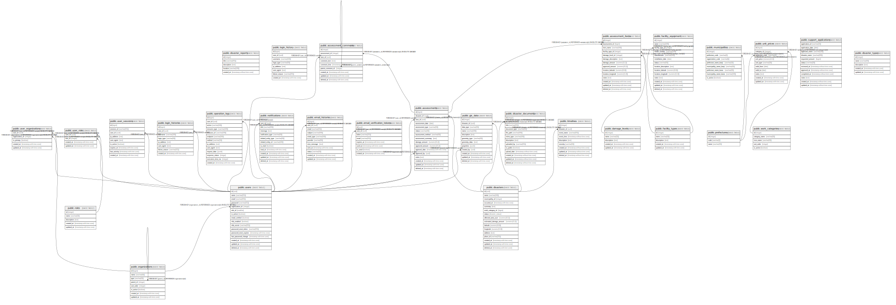

# gen

## Tables

| Name | Columns | Comment | Type |
| ---- | ------- | ------- | ---- |
| [public.disaster_reports](public.disaster_reports.md) | 5 |  | BASE TABLE |
| [public.login_history](public.login_history.md) | 8 | ログイン履歴テーブル - ユーザーのログイン履歴を管理 | BASE TABLE |
| [public.organizations](public.organizations.md) | 8 | 組織マスタ - 農林水産省、地方農政局、都道府県などの組織情報を管理 | BASE TABLE |
| [public.users](public.users.md) | 16 | ユーザーテーブル - システムのユーザー情報を管理 | BASE TABLE |
| [public.user_sessions](public.user_sessions.md) | 9 | ユーザーセッションテーブル - ユーザーのログインセッション情報を管理 | BASE TABLE |
| [public.login_histories](public.login_histories.md) | 8 | ログイン履歴テーブル - ユーザーのログイン履歴を管理 | BASE TABLE |
| [public.operation_logs](public.operation_logs.md) | 13 | 監査ログテーブル - システムの操作履歴を管理 | BASE TABLE |
| [public.prefectures](public.prefectures.md) | 3 |  | BASE TABLE |
| [public.disasters](public.disasters.md) | 16 | 農業災害情報管理テーブル - 各種災害の詳細情報を格納 | BASE TABLE |
| [public.timelines](public.timelines.md) | 9 | 災害タイムライン管理テーブル - 各災害のイベント履歴を格納 | BASE TABLE |
| [public.disaster_documents](public.disaster_documents.md) | 13 | 災害関連書類管理テーブル - 各災害に関連する文書や画像ファイルを格納 | BASE TABLE |
| [public.support_applications](public.support_applications.md) | 12 | 支援申請管理テーブル - 災害時の農業被害に対する支援申請を格納 | BASE TABLE |
| [public.disaster_types](public.disaster_types.md) | 5 | 災害種別マスタテーブル - 災害の種類を管理 | BASE TABLE |
| [public.damage_levels](public.damage_levels.md) | 5 | 被害程度マスタテーブル - 被害の程度を管理 | BASE TABLE |
| [public.facility_types](public.facility_types.md) | 5 | 施設種別マスタテーブル - 農業用施設の種類を管理 | BASE TABLE |
| [public.roles](public.roles.md) | 5 | 役割マスタテーブル - ユーザーの役割を管理 | BASE TABLE |
| [public.user_roles](public.user_roles.md) | 4 | ユーザーロール関連テーブル - ユーザーと役割の関連を管理 | BASE TABLE |
| [public.user_organizations](public.user_organizations.md) | 5 | ユーザー組織関連テーブル - ユーザーと組織の関連を管理 | BASE TABLE |
| [public.assessments](public.assessments.md) | 16 | 査定テーブル - 災害被害の査定情報を管理 | BASE TABLE |
| [public.assessment_items](public.assessment_items.md) | 14 | 査定項目テーブル - 査定の詳細項目を管理 | BASE TABLE |
| [public.assessment_comments](public.assessment_comments.md) | 9 | 査定コメントテーブル - 査定に関するコメントを管理 | BASE TABLE |
| [public.gis_data](public.gis_data.md) | 12 | GIS情報テーブル - 地理空間情報を管理 | BASE TABLE |
| [public.notifications](public.notifications.md) | 12 | 通知テーブル - ユーザーへの通知を管理 | BASE TABLE |
| [public.facility_equipment](public.facility_equipment.md) | 14 | 施設設備マスタテーブル - 施設設備の情報を管理 | BASE TABLE |
| [public.municipalities](public.municipalities.md) | 8 | 市町村マスタテーブル - 全国の都道府県・市区町村の基本情報を管理 | BASE TABLE |
| [public.work_categories](public.work_categories.md) | 5 | 工種区分マスタ - 工種区分の基本情報を管理 | BASE TABLE |
| [public.unit_prices](public.unit_prices.md) | 10 | 単価マスタ - 工種区分ごとの単価を管理 | BASE TABLE |
| [public.email_histories](public.email_histories.md) | 11 | ユーザーのメール送信履歴を保存するテーブル | BASE TABLE |
| [public.email_verification_tokens](public.email_verification_tokens.md) | 8 | メール認証トークンを格納するテーブル | BASE TABLE |

## Stored procedures and functions

| Name | ReturnType | Arguments | Type |
| ---- | ------- | ------- | ---- |
| public.uuid_nil | uuid |  | FUNCTION |
| public.uuid_ns_dns | uuid |  | FUNCTION |
| public.uuid_ns_url | uuid |  | FUNCTION |
| public.uuid_ns_oid | uuid |  | FUNCTION |
| public.uuid_ns_x500 | uuid |  | FUNCTION |
| public.uuid_generate_v1 | uuid |  | FUNCTION |
| public.uuid_generate_v1mc | uuid |  | FUNCTION |
| public.uuid_generate_v3 | uuid | namespace uuid, name text | FUNCTION |
| public.uuid_generate_v4 | uuid |  | FUNCTION |
| public.uuid_generate_v5 | uuid | namespace uuid, name text | FUNCTION |
| public.digest | bytea | text, text | FUNCTION |
| public.digest | bytea | bytea, text | FUNCTION |
| public.hmac | bytea | text, text, text | FUNCTION |
| public.hmac | bytea | bytea, bytea, text | FUNCTION |
| public.crypt | text | text, text | FUNCTION |
| public.gen_salt | text | text | FUNCTION |
| public.gen_salt | text | text, integer | FUNCTION |
| public.encrypt | bytea | bytea, bytea, text | FUNCTION |
| public.decrypt | bytea | bytea, bytea, text | FUNCTION |
| public.encrypt_iv | bytea | bytea, bytea, bytea, text | FUNCTION |
| public.decrypt_iv | bytea | bytea, bytea, bytea, text | FUNCTION |
| public.gen_random_bytes | bytea | integer | FUNCTION |
| public.gen_random_uuid | uuid |  | FUNCTION |
| public.pgp_sym_encrypt | bytea | text, text | FUNCTION |
| public.pgp_sym_encrypt_bytea | bytea | bytea, text | FUNCTION |
| public.pgp_sym_encrypt | bytea | text, text, text | FUNCTION |
| public.pgp_sym_encrypt_bytea | bytea | bytea, text, text | FUNCTION |
| public.pgp_sym_decrypt | text | bytea, text | FUNCTION |
| public.pgp_sym_decrypt_bytea | bytea | bytea, text | FUNCTION |
| public.pgp_sym_decrypt | text | bytea, text, text | FUNCTION |
| public.pgp_sym_decrypt_bytea | bytea | bytea, text, text | FUNCTION |
| public.pgp_pub_encrypt | bytea | text, bytea | FUNCTION |
| public.pgp_pub_encrypt_bytea | bytea | bytea, bytea | FUNCTION |
| public.pgp_pub_encrypt | bytea | text, bytea, text | FUNCTION |
| public.pgp_pub_encrypt_bytea | bytea | bytea, bytea, text | FUNCTION |
| public.pgp_pub_decrypt | text | bytea, bytea | FUNCTION |
| public.pgp_pub_decrypt_bytea | bytea | bytea, bytea | FUNCTION |
| public.pgp_pub_decrypt | text | bytea, bytea, text | FUNCTION |
| public.pgp_pub_decrypt_bytea | bytea | bytea, bytea, text | FUNCTION |
| public.pgp_pub_decrypt | text | bytea, bytea, text, text | FUNCTION |
| public.pgp_pub_decrypt_bytea | bytea | bytea, bytea, text, text | FUNCTION |
| public.pgp_key_id | text | bytea | FUNCTION |
| public.armor | text | bytea | FUNCTION |
| public.armor | text | bytea, text[], text[] | FUNCTION |
| public.dearmor | bytea | text | FUNCTION |
| public.pgp_armor_headers | record | text, OUT key text, OUT value text | FUNCTION |
| public.set_limit | float4 | real | FUNCTION |
| public.show_limit | float4 |  | FUNCTION |
| public.show_trgm | _text | text | FUNCTION |
| public.similarity | float4 | text, text | FUNCTION |
| public.similarity_op | bool | text, text | FUNCTION |
| public.word_similarity | float4 | text, text | FUNCTION |
| public.word_similarity_op | bool | text, text | FUNCTION |
| public.word_similarity_commutator_op | bool | text, text | FUNCTION |
| public.similarity_dist | float4 | text, text | FUNCTION |
| public.word_similarity_dist_op | float4 | text, text | FUNCTION |
| public.word_similarity_dist_commutator_op | float4 | text, text | FUNCTION |
| public.gtrgm_in | gtrgm | cstring | FUNCTION |
| public.gtrgm_out | cstring | gtrgm | FUNCTION |
| public.gtrgm_consistent | bool | internal, text, smallint, oid, internal | FUNCTION |
| public.gtrgm_distance | float8 | internal, text, smallint, oid, internal | FUNCTION |
| public.gtrgm_compress | internal | internal | FUNCTION |
| public.gtrgm_decompress | internal | internal | FUNCTION |
| public.gtrgm_penalty | internal | internal, internal, internal | FUNCTION |
| public.gtrgm_picksplit | internal | internal, internal | FUNCTION |
| public.gtrgm_union | gtrgm | internal, internal | FUNCTION |
| public.gtrgm_same | internal | gtrgm, gtrgm, internal | FUNCTION |
| public.gin_extract_value_trgm | internal | text, internal | FUNCTION |
| public.gin_extract_query_trgm | internal | text, internal, smallint, internal, internal, internal, internal | FUNCTION |
| public.gin_trgm_consistent | bool | internal, smallint, text, integer, internal, internal, internal, internal | FUNCTION |
| public.gin_trgm_triconsistent | char | internal, smallint, text, integer, internal, internal, internal | FUNCTION |
| public.strict_word_similarity | float4 | text, text | FUNCTION |
| public.strict_word_similarity_op | bool | text, text | FUNCTION |
| public.strict_word_similarity_commutator_op | bool | text, text | FUNCTION |
| public.strict_word_similarity_dist_op | float4 | text, text | FUNCTION |
| public.strict_word_similarity_dist_commutator_op | float4 | text, text | FUNCTION |
| public.gtrgm_options | void | internal | FUNCTION |
| public.show_bigm | _text | text | FUNCTION |
| public.bigm_similarity | float4 | text, text | FUNCTION |
| public.bigm_similarity_op | bool | text, text | FUNCTION |
| public.gin_extract_value_bigm | internal | text, internal | FUNCTION |
| public.gin_extract_query_bigm | internal | text, internal, smallint, internal, internal, internal, internal | FUNCTION |
| public.gin_bigm_consistent | bool | internal, smallint, text, integer, internal, internal, internal, internal | FUNCTION |
| public.gin_bigm_compare_partial | bool | text, text, smallint, internal | FUNCTION |
| public.bigmtextcmp | int4 | text, text | FUNCTION |
| public.likequery | text | text | FUNCTION |
| public.pg_gin_pending_stats | record | index regclass, OUT pages integer, OUT tuples bigint | FUNCTION |
| public.gin_bigm_triconsistent | char | internal, smallint, text, integer, internal, internal, internal | FUNCTION |
| public.update_updated_at_column | trigger |  | FUNCTION |
| public.update_master_updated_at_column | trigger |  | FUNCTION |
| public.generate_disaster_reports | int4 | num_records integer DEFAULT 100000 | FUNCTION |
| public.generate_disasters_dummy_data | record | num_records integer DEFAULT 10000, start_date date DEFAULT '2020-01-01'::date, end_date date DEFAULT CURRENT_DATE | FUNCTION |
| public.get_disasters_statistics | record | start_date date DEFAULT '2020-01-01'::date, end_date date DEFAULT CURRENT_DATE | FUNCTION |

## Enums

| Name | Values |
| ---- | ------- |
| public.disaster_status | completed, in_progress, pending, under_review |

## Relations

---

> Generated by [tbls](https://github.com/k1LoW/tbls)
