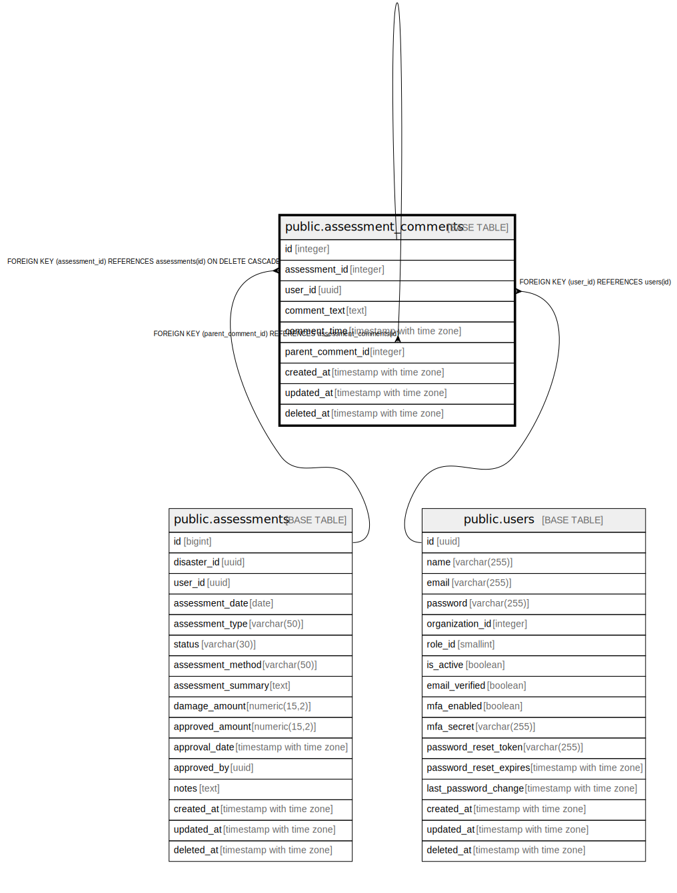

# public.assessment_comments

## Description

査定コメントテーブル - 査定に関するコメントを管理

## Columns

| Name | Type | Default | Nullable | Children | Parents | Comment |
| ---- | ---- | ------- | -------- | -------- | ------- | ------- |
| id | integer | nextval('assessment_comments_id_seq'::regclass) | false | [public.assessment_comments](public.assessment_comments.md) |  | コメントID - 主キー |
| assessment_id | integer |  | false |  | [public.assessments](public.assessments.md) | 査定ID - 関連する査定のID |
| user_id | uuid |  | false |  | [public.users](public.users.md) | ユーザーID - コメントを投稿したユーザーのID |
| comment_text | text |  | false |  |  | コメント本文 - コメントの内容 |
| comment_time | timestamp with time zone | CURRENT_TIMESTAMP | false |  |  | コメント時間 - コメントが投稿された時間 |
| parent_comment_id | integer |  | true |  | [public.assessment_comments](public.assessment_comments.md) | 親コメントID - 返信先のコメントID（スレッド構造用） |
| created_at | timestamp with time zone | CURRENT_TIMESTAMP | false |  |  | 作成日時 - レコード作成日時 |
| updated_at | timestamp with time zone | CURRENT_TIMESTAMP | false |  |  | 更新日時 - レコード最終更新日時 |
| deleted_at | timestamp with time zone |  | true |  |  | 削除日時 - 論理削除用のタイムスタンプ |

## Constraints

| Name | Type | Definition |
| ---- | ---- | ---------- |
| assessment_comments_user_id_fkey | FOREIGN KEY | FOREIGN KEY (user_id) REFERENCES users(id) |
| assessment_comments_assessment_id_fkey | FOREIGN KEY | FOREIGN KEY (assessment_id) REFERENCES assessments(id) ON DELETE CASCADE |
| assessment_comments_parent_comment_id_fkey | FOREIGN KEY | FOREIGN KEY (parent_comment_id) REFERENCES assessment_comments(id) |
| assessment_comments_pkey | PRIMARY KEY | PRIMARY KEY (id) |

## Indexes

| Name | Definition |
| ---- | ---------- |
| assessment_comments_pkey | CREATE UNIQUE INDEX assessment_comments_pkey ON public.assessment_comments USING btree (id) |
| idx_assessment_comments_assessment_id | CREATE INDEX idx_assessment_comments_assessment_id ON public.assessment_comments USING btree (assessment_id) |
| idx_assessment_comments_user_id | CREATE INDEX idx_assessment_comments_user_id ON public.assessment_comments USING btree (user_id) |
| idx_assessment_comments_parent_comment_id | CREATE INDEX idx_assessment_comments_parent_comment_id ON public.assessment_comments USING btree (parent_comment_id) |

## Triggers

| Name | Definition |
| ---- | ---------- |
| update_assessment_comments_updated_at | CREATE TRIGGER update_assessment_comments_updated_at BEFORE UPDATE ON public.assessment_comments FOR EACH ROW EXECUTE FUNCTION update_master_updated_at_column() |

## Relations

---

> Generated by [tbls](https://github.com/k1LoW/tbls)
