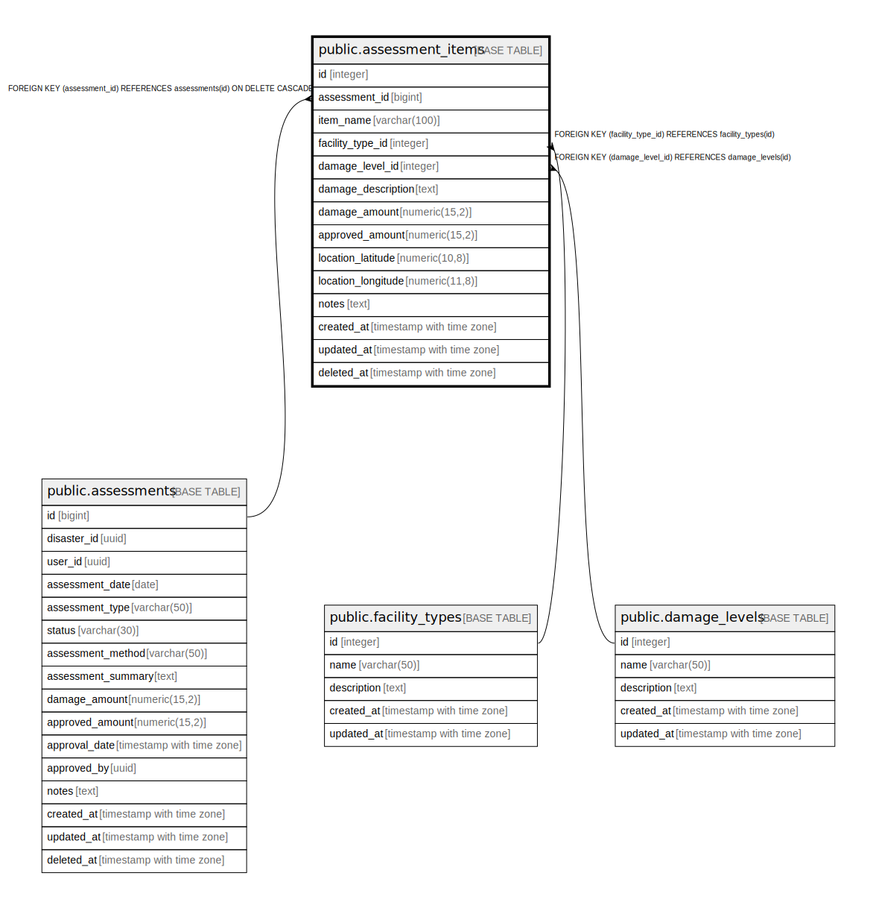

# public.assessment_items

## Description

査定項目テーブル - 査定の詳細項目を管理

## Columns

| Name | Type | Default | Nullable | Children | Parents | Comment |
| ---- | ---- | ------- | -------- | -------- | ------- | ------- |
| id | integer | nextval('assessment_items_id_seq'::regclass) | false |  |  | 査定項目ID - 主キー |
| assessment_id | bigint |  | false |  | [public.assessments](public.assessments.md) | 査定ID - 関連する査定のID |
| item_name | varchar(100) |  | false |  |  | 項目名 - 査定項目の名称 |
| facility_type_id | integer |  | true |  | [public.facility_types](public.facility_types.md) | 施設種別ID - 被害を受けた施設の種別 |
| damage_level_id | integer |  | true |  | [public.damage_levels](public.damage_levels.md) | 被害程度ID - 被害の程度 |
| damage_description | text |  | false |  |  | 被害説明 - 被害状況の詳細説明 |
| damage_amount | numeric(15,2) |  | false |  |  | 被害金額 - 項目ごとの被害金額 |
| approved_amount | numeric(15,2) |  | true |  |  | 承認金額 - 項目ごとの承認金額 |
| location_latitude | numeric(10,8) |  | true |  |  | 位置（緯度） - 被害箇所の緯度 |
| location_longitude | numeric(11,8) |  | true |  |  | 位置（経度） - 被害箇所の経度 |
| notes | text |  | true |  |  | 備考 - 査定項目に関する備考やメモ |
| created_at | timestamp with time zone | CURRENT_TIMESTAMP | false |  |  | 作成日時 - レコード作成日時 |
| updated_at | timestamp with time zone | CURRENT_TIMESTAMP | false |  |  | 更新日時 - レコード最終更新日時 |
| deleted_at | timestamp with time zone |  | true |  |  | 削除日時 - 論理削除用のタイムスタンプ |

## Constraints

| Name | Type | Definition |
| ---- | ---- | ---------- |
| fk_assessment_items_damage_level | FOREIGN KEY | FOREIGN KEY (damage_level_id) REFERENCES damage_levels(id) |
| fk_assessment_items_facility_type | FOREIGN KEY | FOREIGN KEY (facility_type_id) REFERENCES facility_types(id) |
| assessment_items_assessment_id_fkey | FOREIGN KEY | FOREIGN KEY (assessment_id) REFERENCES assessments(id) ON DELETE CASCADE |
| assessment_items_pkey | PRIMARY KEY | PRIMARY KEY (id) |

## Indexes

| Name | Definition |
| ---- | ---------- |
| assessment_items_pkey | CREATE UNIQUE INDEX assessment_items_pkey ON public.assessment_items USING btree (id) |
| idx_assessment_items_assessment_id | CREATE INDEX idx_assessment_items_assessment_id ON public.assessment_items USING btree (assessment_id) |
| idx_assessment_items_facility_type_id | CREATE INDEX idx_assessment_items_facility_type_id ON public.assessment_items USING btree (facility_type_id) |
| idx_assessment_items_damage_level_id | CREATE INDEX idx_assessment_items_damage_level_id ON public.assessment_items USING btree (damage_level_id) |

## Triggers

| Name | Definition |
| ---- | ---------- |
| update_assessment_items_updated_at | CREATE TRIGGER update_assessment_items_updated_at BEFORE UPDATE ON public.assessment_items FOR EACH ROW EXECUTE FUNCTION update_master_updated_at_column() |

## Relations

---

> Generated by [tbls](https://github.com/k1LoW/tbls)
