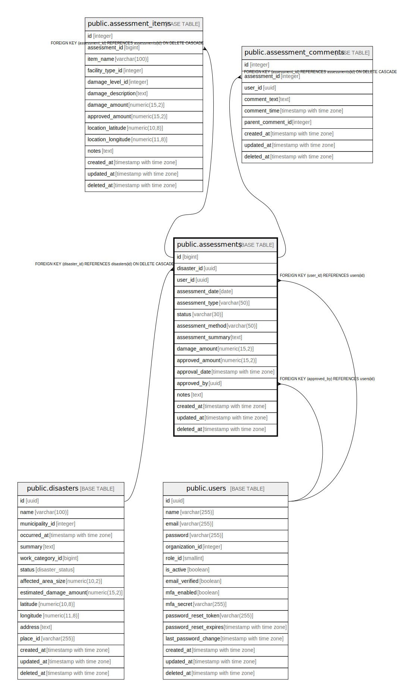

# public.assessments

## Description

査定テーブル - 災害被害の査定情報を管理

## Columns

| Name | Type | Default | Nullable | Children | Parents | Comment |
| ---- | ---- | ------- | -------- | -------- | ------- | ------- |
| id | bigint |  | false | [public.assessment_items](public.assessment_items.md) [public.assessment_comments](public.assessment_comments.md) |  | 査定ID - 主キー |
| disaster_id | uuid |  | false |  | [public.disasters](public.disasters.md) | 災害ID - 査定対象の災害ID |
| user_id | uuid |  | false |  | [public.users](public.users.md) | 査定者ID - 査定を行ったユーザーのID |
| assessment_date | date |  | false |  |  | 査定日 - 査定が行われた日付 |
| assessment_type | varchar(50) |  | false |  |  | 査定種別 - 現地査定、リモート査定など |
| status | varchar(30) | '進行中'::character varying | false |  |  | 状態 - 査定の進行状況 |
| assessment_method | varchar(50) |  | false |  |  | 査定方法 - 査定の実施方法 |
| assessment_summary | text |  | true |  |  | 査定概要 - 査定結果の概要 |
| damage_amount | numeric(15,2) |  | true |  |  | 被害金額 - 査定された被害金額 |
| approved_amount | numeric(15,2) |  | true |  |  | 承認金額 - 承認された支援金額 |
| approval_date | timestamp with time zone |  | true |  |  | 承認日時 - 査定が承認された日時 |
| approved_by | uuid |  | true |  | [public.users](public.users.md) | 承認者ID - 査定を承認したユーザーのID |
| notes | text |  | true |  |  | 備考 - 査定に関する備考やメモ |
| created_at | timestamp with time zone | CURRENT_TIMESTAMP | false |  |  | 作成日時 - レコード作成日時 |
| updated_at | timestamp with time zone | CURRENT_TIMESTAMP | false |  |  | 更新日時 - レコード最終更新日時 |
| deleted_at | timestamp with time zone |  | true |  |  | 削除日時 - 論理削除用のタイムスタンプ |

## Constraints

| Name | Type | Definition |
| ---- | ---- | ---------- |
| assessments_assessment_method_check | CHECK | CHECK (((assessment_method)::text = ANY ((ARRAY['現地査定'::character varying, 'リモート査定'::character varying, '書類査定'::character varying, '緊急査定'::character varying])::text[]))) |
| assessments_status_check | CHECK | CHECK (((status)::text = ANY ((ARRAY['準備中'::character varying, '進行中'::character varying, '完了'::character varying, '差戻し'::character varying, '承認済'::character varying])::text[]))) |
| assessments_approved_by_fkey | FOREIGN KEY | FOREIGN KEY (approved_by) REFERENCES users(id) |
| assessments_user_id_fkey | FOREIGN KEY | FOREIGN KEY (user_id) REFERENCES users(id) |
| assessments_disaster_id_fkey | FOREIGN KEY | FOREIGN KEY (disaster_id) REFERENCES disasters(id) ON DELETE CASCADE |
| assessments_pkey | PRIMARY KEY | PRIMARY KEY (id) |

## Indexes

| Name | Definition |
| ---- | ---------- |
| assessments_pkey | CREATE UNIQUE INDEX assessments_pkey ON public.assessments USING btree (id) |
| idx_assessments_disaster_id | CREATE INDEX idx_assessments_disaster_id ON public.assessments USING btree (disaster_id) |
| idx_assessments_user_id | CREATE INDEX idx_assessments_user_id ON public.assessments USING btree (user_id) |
| idx_assessments_assessment_date | CREATE INDEX idx_assessments_assessment_date ON public.assessments USING btree (assessment_date) |
| idx_assessments_status | CREATE INDEX idx_assessments_status ON public.assessments USING btree (status) |

## Triggers

| Name | Definition |
| ---- | ---------- |
| update_assessments_updated_at | CREATE TRIGGER update_assessments_updated_at BEFORE UPDATE ON public.assessments FOR EACH ROW EXECUTE FUNCTION update_master_updated_at_column() |

## Relations

---

> Generated by [tbls](https://github.com/k1LoW/tbls)
