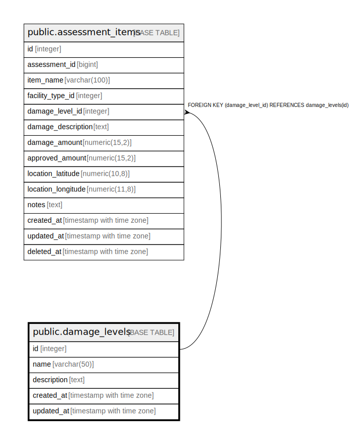

# public.damage_levels

## Description

被害程度マスタテーブル - 被害の程度を管理

## Columns

| Name | Type | Default | Nullable | Children | Parents | Comment |
| ---- | ---- | ------- | -------- | -------- | ------- | ------- |
| id | integer | nextval('damage_levels_id_seq'::regclass) | false | [public.assessment_items](public.assessment_items.md) |  | 被害程度ID - 主キー |
| name | varchar(50) |  | false |  |  | 被害程度名 - 軽微, 中程度, 深刻, 甚大など |
| description | text |  | true |  |  | 説明 - 被害程度の詳細説明 |
| created_at | timestamp with time zone | CURRENT_TIMESTAMP | false |  |  | 作成日時 - レコード作成日時 |
| updated_at | timestamp with time zone | CURRENT_TIMESTAMP | false |  |  | 更新日時 - レコード最終更新日時 |

## Constraints

| Name | Type | Definition |
| ---- | ---- | ---------- |
| damage_levels_pkey | PRIMARY KEY | PRIMARY KEY (id) |
| damage_levels_name_key | UNIQUE | UNIQUE (name) |

## Indexes

| Name | Definition |
| ---- | ---------- |
| damage_levels_pkey | CREATE UNIQUE INDEX damage_levels_pkey ON public.damage_levels USING btree (id) |
| damage_levels_name_key | CREATE UNIQUE INDEX damage_levels_name_key ON public.damage_levels USING btree (name) |
| idx_damage_levels_name | CREATE INDEX idx_damage_levels_name ON public.damage_levels USING btree (name) |

## Triggers

| Name | Definition |
| ---- | ---------- |
| update_damage_levels_updated_at | CREATE TRIGGER update_damage_levels_updated_at BEFORE UPDATE ON public.damage_levels FOR EACH ROW EXECUTE FUNCTION update_master_updated_at_column() |

## Relations

---

> Generated by [tbls](https://github.com/k1LoW/tbls)
