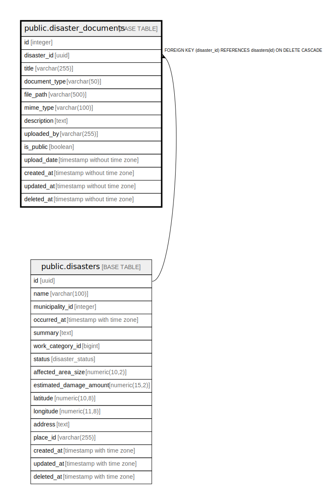

# public.disaster_documents

## Description

災害関連書類管理テーブル - 各災害に関連する文書や画像ファイルを格納

## Columns

| Name | Type | Default | Nullable | Children | Parents | Comment |
| ---- | ---- | ------- | -------- | -------- | ------- | ------- |
| id | integer | nextval('disaster_documents_id_seq'::regclass) | false |  |  | 書類ID - 主キー |
| disaster_id | uuid |  | false |  | [public.disasters](public.disasters.md) | 災害ID - 関連する災害のID |
| title | varchar(255) |  | false |  |  | 書類タイトル - 文書の名称 |
| document_type | varchar(50) |  | false |  |  | 書類種別 - 報告書, 写真, 申請書, 証明書など |
| file_path | varchar(500) |  | false |  |  | ファイルパス - ファイルの保存場所 |
| mime_type | varchar(100) |  | false |  |  | MIMEタイプ - ファイルの形式を示すMIMEタイプ |
| description | text |  | true |  |  | 説明 - ファイルの説明や備考 |
| uploaded_by | varchar(255) |  | false |  |  | アップロード者 - ファイルをアップロードしたユーザー名 |
| is_public | boolean | false | false |  |  | 公開フラグ - 一般公開するかどうか |
| upload_date | timestamp without time zone | CURRENT_TIMESTAMP | false |  |  | アップロード日時 - ファイルがアップロードされた日時 |
| created_at | timestamp without time zone | CURRENT_TIMESTAMP | false |  |  | 作成日時 - レコード作成日時 |
| updated_at | timestamp without time zone | CURRENT_TIMESTAMP | false |  |  | 更新日時 - レコード最終更新日時 |
| deleted_at | timestamp without time zone |  | true |  |  | 削除日時 - 論理削除用のタイムスタンプ |

## Constraints

| Name | Type | Definition |
| ---- | ---- | ---------- |
| disaster_documents_disaster_id_fkey | FOREIGN KEY | FOREIGN KEY (disaster_id) REFERENCES disasters(id) ON DELETE CASCADE |
| disaster_documents_pkey | PRIMARY KEY | PRIMARY KEY (id) |

## Indexes

| Name | Definition |
| ---- | ---------- |
| disaster_documents_pkey | CREATE UNIQUE INDEX disaster_documents_pkey ON public.disaster_documents USING btree (id) |
| idx_disaster_documents_disaster_id | CREATE INDEX idx_disaster_documents_disaster_id ON public.disaster_documents USING btree (disaster_id) |
| idx_disaster_documents_document_type | CREATE INDEX idx_disaster_documents_document_type ON public.disaster_documents USING btree (document_type) |
| idx_disaster_documents_upload_date | CREATE INDEX idx_disaster_documents_upload_date ON public.disaster_documents USING btree (upload_date) |

## Relations

---

> Generated by [tbls](https://github.com/k1LoW/tbls)
