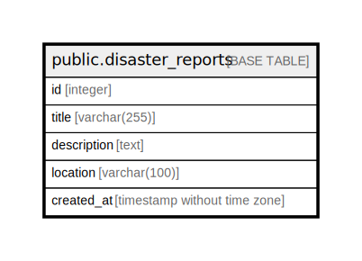

# public.disaster_reports

## Description

## Columns

| Name | Type | Default | Nullable | Children | Parents | Comment |
| ---- | ---- | ------- | -------- | -------- | ------- | ------- |
| id | integer | nextval('disaster_reports_id_seq'::regclass) | false |  |  |  |
| title | varchar(255) |  | true |  |  |  |
| description | text |  | true |  |  |  |
| location | varchar(100) |  | true |  |  |  |
| created_at | timestamp without time zone | CURRENT_TIMESTAMP | true |  |  |  |

## Constraints

| Name | Type | Definition |
| ---- | ---- | ---------- |
| disaster_reports_pkey | PRIMARY KEY | PRIMARY KEY (id) |

## Indexes

| Name | Definition |
| ---- | ---------- |
| disaster_reports_pkey | CREATE UNIQUE INDEX disaster_reports_pkey ON public.disaster_reports USING btree (id) |
| idx_disaster_reports_title_trgm | CREATE INDEX idx_disaster_reports_title_trgm ON public.disaster_reports USING gin (title gin_trgm_ops) |
| idx_disaster_reports_description_trgm | CREATE INDEX idx_disaster_reports_description_trgm ON public.disaster_reports USING gin (description gin_trgm_ops) |
| idx_disaster_reports_title_bigm | CREATE INDEX idx_disaster_reports_title_bigm ON public.disaster_reports USING gin (title gin_bigm_ops) |
| idx_disaster_reports_description_bigm | CREATE INDEX idx_disaster_reports_description_bigm ON public.disaster_reports USING gin (description gin_bigm_ops) |

## Relations

---

> Generated by [tbls](https://github.com/k1LoW/tbls)
