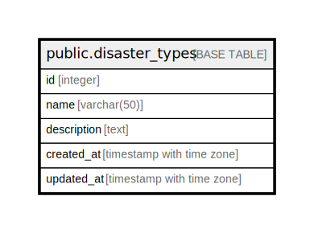

# public.disaster_types

## Description

災害種別マスタテーブル - 災害の種類を管理

## Columns

| Name | Type | Default | Nullable | Children | Parents | Comment |
| ---- | ---- | ------- | -------- | -------- | ------- | ------- |
| id | integer | nextval('disaster_types_id_seq'::regclass) | false |  |  | 災害種別ID - 主キー |
| name | varchar(50) |  | false |  |  | 災害種別名 - 洪水, 地滑り, 雹害, 干ばつ, 風害, 地震, 霜害, 病害虫など |
| description | text |  | true |  |  | 説明 - 災害種別の詳細説明 |
| created_at | timestamp with time zone | CURRENT_TIMESTAMP | false |  |  | 作成日時 - レコード作成日時 |
| updated_at | timestamp with time zone | CURRENT_TIMESTAMP | false |  |  | 更新日時 - レコード最終更新日時 |

## Constraints

| Name | Type | Definition |
| ---- | ---- | ---------- |
| disaster_types_pkey | PRIMARY KEY | PRIMARY KEY (id) |
| disaster_types_name_key | UNIQUE | UNIQUE (name) |

## Indexes

| Name | Definition |
| ---- | ---------- |
| disaster_types_pkey | CREATE UNIQUE INDEX disaster_types_pkey ON public.disaster_types USING btree (id) |
| disaster_types_name_key | CREATE UNIQUE INDEX disaster_types_name_key ON public.disaster_types USING btree (name) |
| idx_disaster_types_name | CREATE INDEX idx_disaster_types_name ON public.disaster_types USING btree (name) |

## Triggers

| Name | Definition |
| ---- | ---------- |
| update_disaster_types_updated_at | CREATE TRIGGER update_disaster_types_updated_at BEFORE UPDATE ON public.disaster_types FOR EACH ROW EXECUTE FUNCTION update_master_updated_at_column() |

## Relations

---

> Generated by [tbls](https://github.com/k1LoW/tbls)
