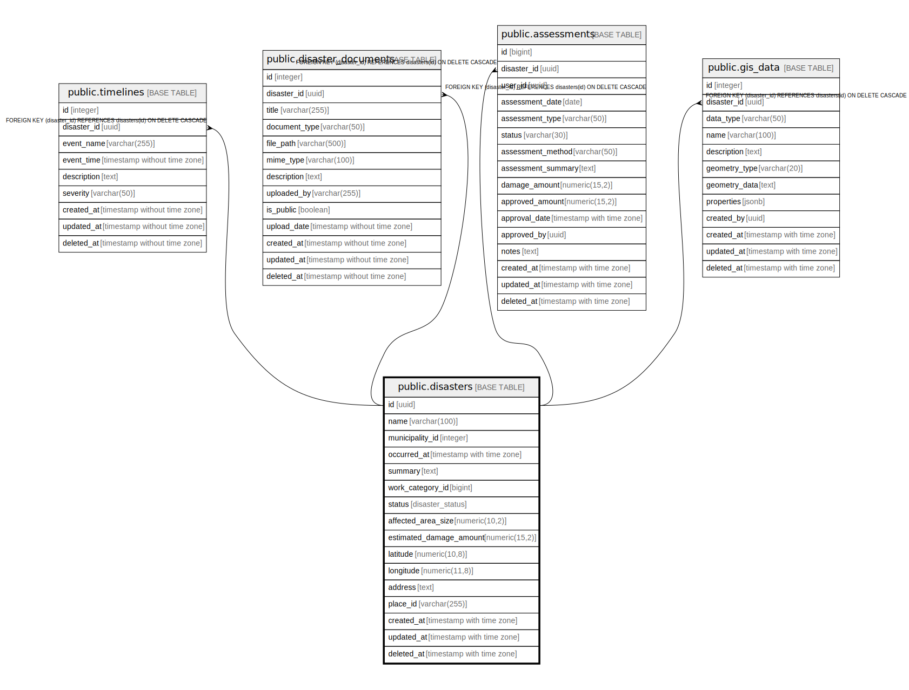

# public.disasters

## Description

農業災害情報管理テーブル - 各種災害の詳細情報を格納

## Columns

| Name | Type | Default | Nullable | Children | Parents | Comment |
| ---- | ---- | ------- | -------- | -------- | ------- | ------- |
| id | uuid | gen_random_uuid() | false | [public.timelines](public.timelines.md) [public.disaster_documents](public.disaster_documents.md) [public.assessments](public.assessments.md) [public.gis_data](public.gis_data.md) |  | 災害ID - 主キー |
| name | varchar(100) |  | false |  |  | 災害名 - 災害の名称 |
| municipality_id | integer |  | false |  |  | 自治体ID - 関連する自治体のID |
| occurred_at | timestamp with time zone |  | false |  |  | 発生日時 - 災害が発生した日時 |
| summary | text |  | false |  |  | 被害概要 - 災害による被害の詳細説明 |
| work_category_id | bigint |  | false |  |  | 工種区分ID - 関連する作業カテゴリのID |
| status | disaster_status | 'pending'::disaster_status | false |  |  | 状態 - pending(未着手), under_review(審査中), in_progress(対応中), completed(完了)のいずれか |
| affected_area_size | numeric(10,2) |  | true |  |  | 被害面積 - ヘクタール (ha) 単位での被害エリアの広さ |
| estimated_damage_amount | numeric(15,2) |  | true |  |  | 被害推定金額 - 円単位での被害総額 |
| latitude | numeric(10,8) |  | true |  |  | 緯度 - 災害発生地点の緯度座標 |
| longitude | numeric(11,8) |  | true |  |  | 経度 - 災害発生地点の経度座標 |
| address | text |  | true |  |  | 住所 - Google Maps APIから取得した住所情報 |
| place_id | varchar(255) |  | true |  |  | Google Place ID - Google Maps APIの場所識別子 |
| created_at | timestamp with time zone | CURRENT_TIMESTAMP | false |  |  | 作成日時 - レコード作成日時 |
| updated_at | timestamp with time zone | CURRENT_TIMESTAMP | false |  |  | 更新日時 - レコード最終更新日時 |
| deleted_at | timestamp with time zone |  | true |  |  | 削除日時 - 論理削除用のタイムスタンプ |

## Constraints

| Name | Type | Definition |
| ---- | ---- | ---------- |
| disasters_pkey | PRIMARY KEY | PRIMARY KEY (id) |

## Indexes

| Name | Definition |
| ---- | ---------- |
| disasters_pkey | CREATE UNIQUE INDEX disasters_pkey ON public.disasters USING btree (id) |
| idx_disasters_municipality_id | CREATE INDEX idx_disasters_municipality_id ON public.disasters USING btree (municipality_id) |
| idx_disasters_work_category_id | CREATE INDEX idx_disasters_work_category_id ON public.disasters USING btree (work_category_id) |
| idx_disasters_status | CREATE INDEX idx_disasters_status ON public.disasters USING btree (status) |
| idx_disasters_occurred_at | CREATE INDEX idx_disasters_occurred_at ON public.disasters USING btree (occurred_at) |
| idx_disasters_latitude_longitude | CREATE INDEX idx_disasters_latitude_longitude ON public.disasters USING btree (latitude, longitude) |
| idx_disasters_place_id | CREATE INDEX idx_disasters_place_id ON public.disasters USING btree (place_id) |

## Relations

---

> Generated by [tbls](https://github.com/k1LoW/tbls)
