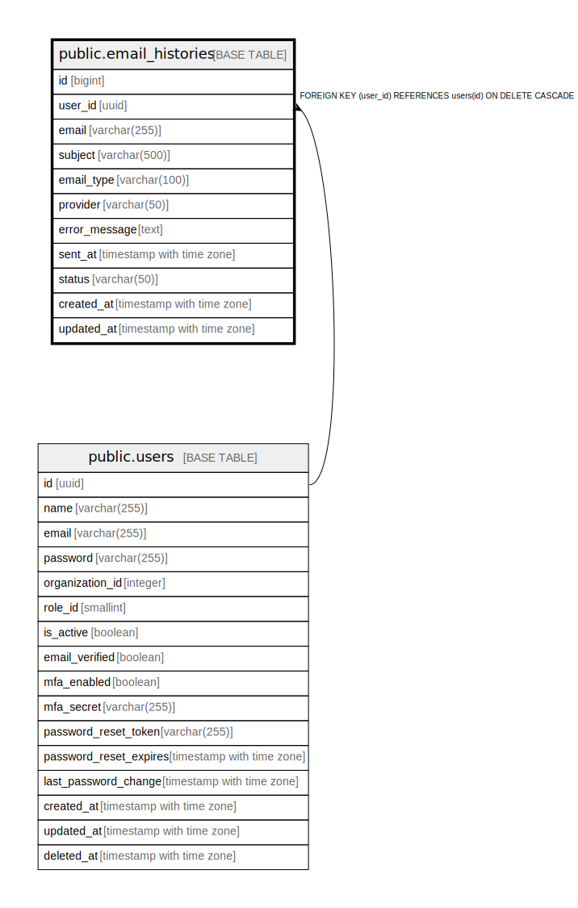

# public.email_histories

## Description

ユーザーのメール送信履歴を保存するテーブル

## Columns

| Name | Type | Default | Nullable | Children | Parents | Comment |
| ---- | ---- | ------- | -------- | -------- | ------- | ------- |
| id | bigint | nextval('email_histories_id_seq'::regclass) | false |  |  | メール履歴ID |
| user_id | uuid |  | false |  | [public.users](public.users.md) | ユーザーID |
| email | varchar(255) |  | false |  |  | 送信先メールアドレス |
| subject | varchar(500) |  | false |  |  | メール件名 |
| email_type | varchar(100) |  | false |  |  | メール種別（welcome, verification, password_reset等） |
| provider | varchar(50) |  | false |  |  | メール送信プロバイダー（smtp, sendgrid等） |
| error_message | text |  | true |  |  | エラーメッセージ（送信失敗時） |
| sent_at | timestamp with time zone | CURRENT_TIMESTAMP | false |  |  | メール送信日時 |
| status | varchar(50) |  | false |  |  | メール送信ステータス（sent, failed, pending等） |
| created_at | timestamp with time zone | CURRENT_TIMESTAMP | true |  |  | 作成日時 |
| updated_at | timestamp with time zone | CURRENT_TIMESTAMP | true |  |  | 更新日時 |

## Constraints

| Name | Type | Definition |
| ---- | ---- | ---------- |
| email_histories_user_id_fkey | FOREIGN KEY | FOREIGN KEY (user_id) REFERENCES users(id) ON DELETE CASCADE |
| email_histories_pkey | PRIMARY KEY | PRIMARY KEY (id) |

## Indexes

| Name | Definition |
| ---- | ---------- |
| email_histories_pkey | CREATE UNIQUE INDEX email_histories_pkey ON public.email_histories USING btree (id) |
| idx_email_histories_user_id | CREATE INDEX idx_email_histories_user_id ON public.email_histories USING btree (user_id) |
| idx_email_histories_email | CREATE INDEX idx_email_histories_email ON public.email_histories USING btree (email) |
| idx_email_histories_status | CREATE INDEX idx_email_histories_status ON public.email_histories USING btree (status) |
| idx_email_histories_email_type | CREATE INDEX idx_email_histories_email_type ON public.email_histories USING btree (email_type) |
| idx_email_histories_sent_at | CREATE INDEX idx_email_histories_sent_at ON public.email_histories USING btree (sent_at) |

## Relations

---

> Generated by [tbls](https://github.com/k1LoW/tbls)
