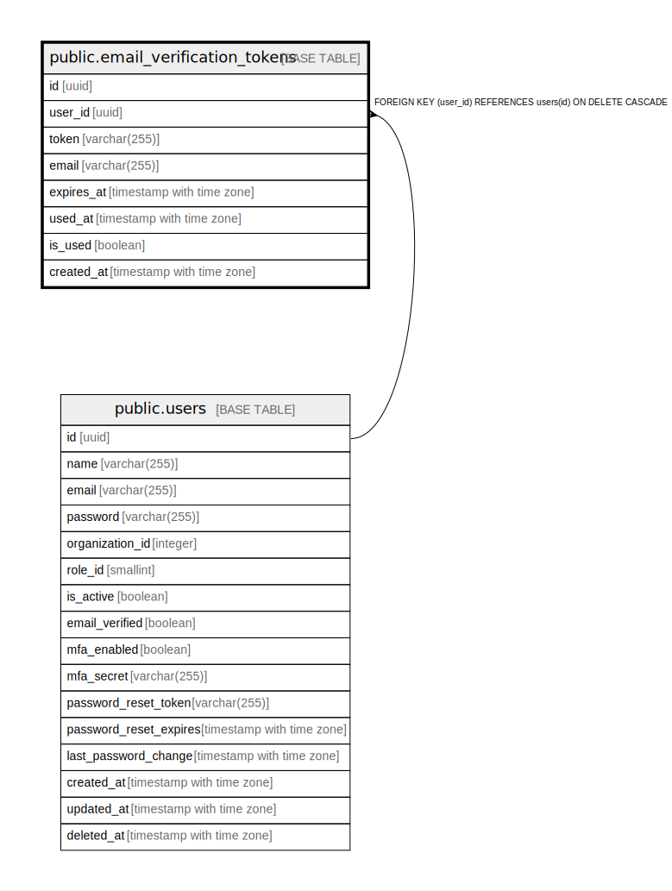

# public.email_verification_tokens

## Description

メール認証トークンを格納するテーブル

## Columns

| Name | Type | Default | Nullable | Children | Parents | Comment |
| ---- | ---- | ------- | -------- | -------- | ------- | ------- |
| id | uuid | gen_random_uuid() | false |  |  | トークンの一意な識別子 |
| user_id | uuid |  | false |  | [public.users](public.users.md) | 関連するユーザーのID |
| token | varchar(255) |  | false |  |  | メール認証トークン |
| email | varchar(255) |  | false |  |  | 認証対象のメールアドレス |
| expires_at | timestamp with time zone |  | false |  |  | トークンの有効期限 |
| used_at | timestamp with time zone |  | true |  |  | トークンが使用された日時 |
| is_used | boolean | false | false |  |  | トークンが使用されたかどうか |
| created_at | timestamp with time zone | CURRENT_TIMESTAMP | false |  |  | トークンの作成日時 |

## Constraints

| Name | Type | Definition |
| ---- | ---- | ---------- |
| email_verification_tokens_user_id_fkey | FOREIGN KEY | FOREIGN KEY (user_id) REFERENCES users(id) ON DELETE CASCADE |
| email_verification_tokens_pkey | PRIMARY KEY | PRIMARY KEY (id) |
| email_verification_tokens_token_key | UNIQUE | UNIQUE (token) |

## Indexes

| Name | Definition |
| ---- | ---------- |
| email_verification_tokens_pkey | CREATE UNIQUE INDEX email_verification_tokens_pkey ON public.email_verification_tokens USING btree (id) |
| email_verification_tokens_token_key | CREATE UNIQUE INDEX email_verification_tokens_token_key ON public.email_verification_tokens USING btree (token) |
| idx_email_verification_tokens_user_id | CREATE INDEX idx_email_verification_tokens_user_id ON public.email_verification_tokens USING btree (user_id) |
| idx_email_verification_tokens_token | CREATE INDEX idx_email_verification_tokens_token ON public.email_verification_tokens USING btree (token) |
| idx_email_verification_tokens_expires_at | CREATE INDEX idx_email_verification_tokens_expires_at ON public.email_verification_tokens USING btree (expires_at) |

## Relations

---

> Generated by [tbls](https://github.com/k1LoW/tbls)
