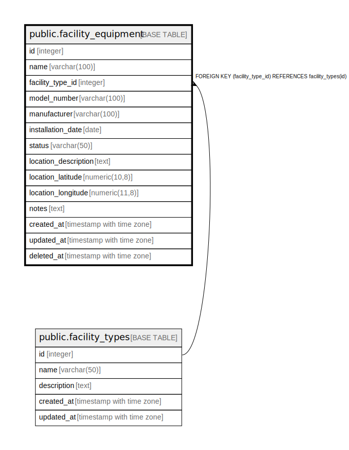

# public.facility_equipment

## Description

施設設備マスタテーブル - 施設設備の情報を管理

## Columns

| Name | Type | Default | Nullable | Children | Parents | Comment |
| ---- | ---- | ------- | -------- | -------- | ------- | ------- |
| id | integer | nextval('facility_equipment_id_seq'::regclass) | false |  |  | 施設設備ID - 主キー |
| name | varchar(100) |  | false |  |  | 施設設備名 - 施設設備の名称 |
| facility_type_id | integer |  | false |  | [public.facility_types](public.facility_types.md) | 施設種別ID - 施設設備の種別 |
| model_number | varchar(100) |  | true |  |  | 型番 - 施設設備の型番 |
| manufacturer | varchar(100) |  | true |  |  | メーカー - 施設設備のメーカー |
| installation_date | date |  | true |  |  | 設置日 - 施設設備の設置日 |
| status | varchar(50) | '稼働中'::character varying | false |  |  | 状態 - 施設設備の稼働状態 |
| location_description | text |  | true |  |  | 設置場所説明 - 施設設備の設置場所の説明 |
| location_latitude | numeric(10,8) |  | true |  |  | 位置（緯度） - 施設設備の緯度 |
| location_longitude | numeric(11,8) |  | true |  |  | 位置（経度） - 施設設備の経度 |
| notes | text |  | true |  |  | 備考 - 施設設備に関する備考やメモ |
| created_at | timestamp with time zone | CURRENT_TIMESTAMP | false |  |  | 作成日時 - レコード作成日時 |
| updated_at | timestamp with time zone | CURRENT_TIMESTAMP | false |  |  | 更新日時 - レコード最終更新日時 |
| deleted_at | timestamp with time zone |  | true |  |  | 削除日時 - 論理削除用のタイムスタンプ |

## Constraints

| Name | Type | Definition |
| ---- | ---- | ---------- |
| facility_equipment_status_check | CHECK | CHECK (((status)::text = ANY ((ARRAY['稼働中'::character varying, '点検中'::character varying, '故障中'::character varying, '廃止'::character varying])::text[]))) |
| facility_equipment_facility_type_id_fkey | FOREIGN KEY | FOREIGN KEY (facility_type_id) REFERENCES facility_types(id) |
| facility_equipment_pkey | PRIMARY KEY | PRIMARY KEY (id) |

## Indexes

| Name | Definition |
| ---- | ---------- |
| facility_equipment_pkey | CREATE UNIQUE INDEX facility_equipment_pkey ON public.facility_equipment USING btree (id) |
| idx_facility_equipment_name | CREATE INDEX idx_facility_equipment_name ON public.facility_equipment USING btree (name) |
| idx_facility_equipment_facility_type_id | CREATE INDEX idx_facility_equipment_facility_type_id ON public.facility_equipment USING btree (facility_type_id) |
| idx_facility_equipment_status | CREATE INDEX idx_facility_equipment_status ON public.facility_equipment USING btree (status) |

## Triggers

| Name | Definition |
| ---- | ---------- |
| update_facility_equipment_updated_at | CREATE TRIGGER update_facility_equipment_updated_at BEFORE UPDATE ON public.facility_equipment FOR EACH ROW EXECUTE FUNCTION update_master_updated_at_column() |

## Relations

---

> Generated by [tbls](https://github.com/k1LoW/tbls)
