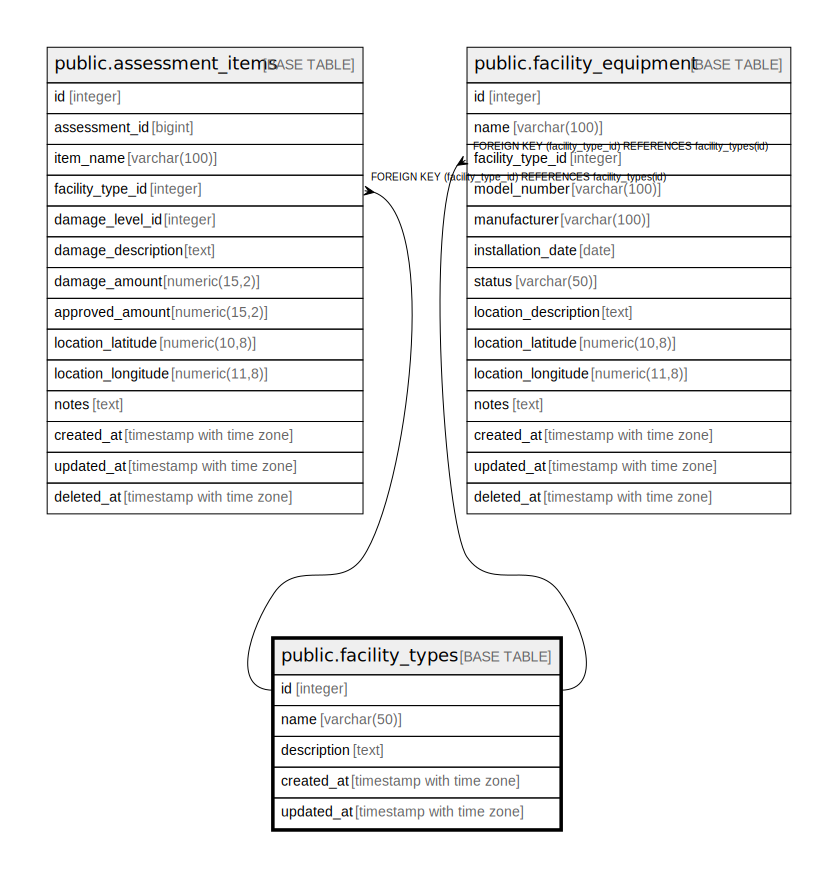

# public.facility_types

## Description

施設種別マスタテーブル - 農業用施設の種類を管理

## Columns

| Name | Type | Default | Nullable | Children | Parents | Comment |
| ---- | ---- | ------- | -------- | -------- | ------- | ------- |
| id | integer | nextval('facility_types_id_seq'::regclass) | false | [public.assessment_items](public.assessment_items.md) [public.facility_equipment](public.facility_equipment.md) |  | 施設種別ID - 主キー |
| name | varchar(50) |  | false |  |  | 施設種別名 - 水路, ため池, 農道, ビニールハウスなど |
| description | text |  | true |  |  | 説明 - 施設種別の詳細説明 |
| created_at | timestamp with time zone | CURRENT_TIMESTAMP | false |  |  | 作成日時 - レコード作成日時 |
| updated_at | timestamp with time zone | CURRENT_TIMESTAMP | false |  |  | 更新日時 - レコード最終更新日時 |

## Constraints

| Name | Type | Definition |
| ---- | ---- | ---------- |
| facility_types_pkey | PRIMARY KEY | PRIMARY KEY (id) |
| facility_types_name_key | UNIQUE | UNIQUE (name) |

## Indexes

| Name | Definition |
| ---- | ---------- |
| facility_types_pkey | CREATE UNIQUE INDEX facility_types_pkey ON public.facility_types USING btree (id) |
| facility_types_name_key | CREATE UNIQUE INDEX facility_types_name_key ON public.facility_types USING btree (name) |
| idx_facility_types_name | CREATE INDEX idx_facility_types_name ON public.facility_types USING btree (name) |

## Triggers

| Name | Definition |
| ---- | ---------- |
| update_facility_types_updated_at | CREATE TRIGGER update_facility_types_updated_at BEFORE UPDATE ON public.facility_types FOR EACH ROW EXECUTE FUNCTION update_master_updated_at_column() |

## Relations

---

> Generated by [tbls](https://github.com/k1LoW/tbls)
