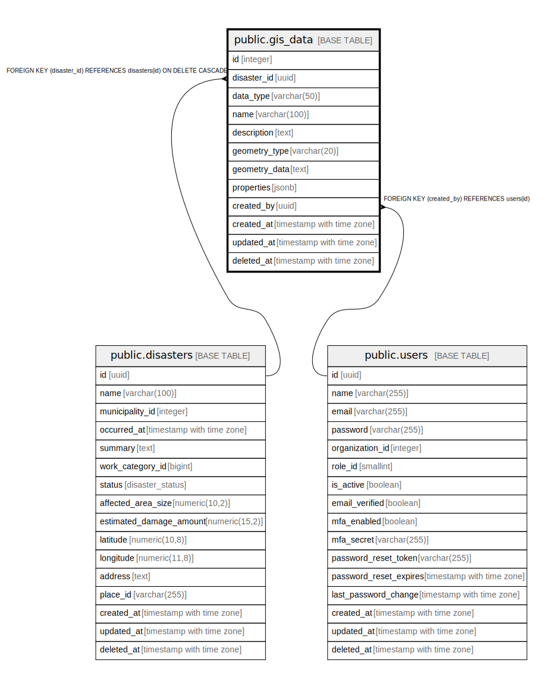

# public.gis_data

## Description

GIS情報テーブル - 地理空間情報を管理

## Columns

| Name | Type | Default | Nullable | Children | Parents | Comment |
| ---- | ---- | ------- | -------- | -------- | ------- | ------- |
| id | integer | nextval('gis_data_id_seq'::regclass) | false |  |  | GISデータID - 主キー |
| disaster_id | uuid |  | false |  | [public.disasters](public.disasters.md) | 災害ID - 関連する災害のID |
| data_type | varchar(50) |  | false |  |  | データ種別 - GISデータの種類 |
| name | varchar(100) |  | false |  |  | 名称 - GISデータの名称 |
| description | text |  | true |  |  | 説明 - GISデータの説明 |
| geometry_type | varchar(20) |  | false |  |  | ジオメトリ種別 - 地理データの形状タイプ |
| geometry_data | text |  | false |  |  | ジオメトリデータ - GeoJSON形式の地理データ |
| properties | jsonb |  | true |  |  | プロパティ - 追加のプロパティ情報（JSON形式） |
| created_by | uuid |  | false |  | [public.users](public.users.md) | 作成者ID - データを作成したユーザーのID |
| created_at | timestamp with time zone | CURRENT_TIMESTAMP | false |  |  | 作成日時 - レコード作成日時 |
| updated_at | timestamp with time zone | CURRENT_TIMESTAMP | false |  |  | 更新日時 - レコード最終更新日時 |
| deleted_at | timestamp with time zone |  | true |  |  | 削除日時 - 論理削除用のタイムスタンプ |

## Constraints

| Name | Type | Definition |
| ---- | ---- | ---------- |
| gis_data_data_type_check | CHECK | CHECK (((data_type)::text = ANY ((ARRAY['被害エリア'::character varying, '避難経路'::character varying, '施設位置'::character varying, 'リソース配置'::character varying, 'その他'::character varying])::text[]))) |
| gis_data_geometry_type_check | CHECK | CHECK (((geometry_type)::text = ANY ((ARRAY['POINT'::character varying, 'LINESTRING'::character varying, 'POLYGON'::character varying, 'MULTIPOINT'::character varying, 'MULTILINESTRING'::character varying, 'MULTIPOLYGON'::character varying])::text[]))) |
| gis_data_created_by_fkey | FOREIGN KEY | FOREIGN KEY (created_by) REFERENCES users(id) |
| gis_data_disaster_id_fkey | FOREIGN KEY | FOREIGN KEY (disaster_id) REFERENCES disasters(id) ON DELETE CASCADE |
| gis_data_pkey | PRIMARY KEY | PRIMARY KEY (id) |

## Indexes

| Name | Definition |
| ---- | ---------- |
| gis_data_pkey | CREATE UNIQUE INDEX gis_data_pkey ON public.gis_data USING btree (id) |
| idx_gis_data_disaster_id | CREATE INDEX idx_gis_data_disaster_id ON public.gis_data USING btree (disaster_id) |
| idx_gis_data_data_type | CREATE INDEX idx_gis_data_data_type ON public.gis_data USING btree (data_type) |
| idx_gis_data_created_by | CREATE INDEX idx_gis_data_created_by ON public.gis_data USING btree (created_by) |

## Triggers

| Name | Definition |
| ---- | ---------- |
| update_gis_data_updated_at | CREATE TRIGGER update_gis_data_updated_at BEFORE UPDATE ON public.gis_data FOR EACH ROW EXECUTE FUNCTION update_master_updated_at_column() |

## Relations

---

> Generated by [tbls](https://github.com/k1LoW/tbls)
