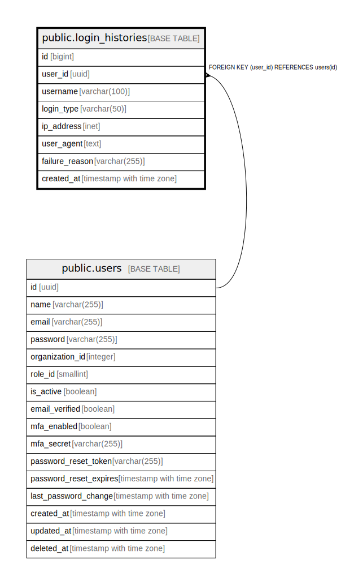

# public.login_histories

## Description

ログイン履歴テーブル - ユーザーのログイン履歴を管理

## Columns

| Name | Type | Default | Nullable | Children | Parents | Comment |
| ---- | ---- | ------- | -------- | -------- | ------- | ------- |
| id | bigint |  | false |  |  | ログイン履歴ID（主キー、自動掲番） |
| user_id | uuid |  | true |  | [public.users](public.users.md) | ユーザーID（外部キー、ユーザーテーブルのID） |
| username | varchar(100) |  | true |  |  | ユーザー名（ユーザーが削除されても履歴を残すため） |
| login_type | varchar(50) |  | false |  |  | ログインタイプ（成功: success、失敗: failed、ロック: locked、多要素認証必要: mfa_required） |
| ip_address | inet |  | true |  |  | ユーザーのIPアドレス |
| user_agent | text |  | true |  |  | ユーザーエージェント情報（ブラウザやデバイス情報） |
| failure_reason | varchar(255) |  | true |  |  | ログイン失敗理由（失敗時のみ） |
| created_at | timestamp with time zone | CURRENT_TIMESTAMP | true |  |  | ログイン履歴の作成日時 |

## Constraints

| Name | Type | Definition |
| ---- | ---- | ---------- |
| login_histories_user_id_fkey | FOREIGN KEY | FOREIGN KEY (user_id) REFERENCES users(id) |
| login_histories_pkey | PRIMARY KEY | PRIMARY KEY (id) |

## Indexes

| Name | Definition |
| ---- | ---------- |
| login_histories_pkey | CREATE UNIQUE INDEX login_histories_pkey ON public.login_histories USING btree (id) |
| idx_login_histories_user_id | CREATE INDEX idx_login_histories_user_id ON public.login_histories USING btree (user_id) |
| idx_login_histories_username | CREATE INDEX idx_login_histories_username ON public.login_histories USING btree (username) |

## Relations

---

> Generated by [tbls](https://github.com/k1LoW/tbls)
