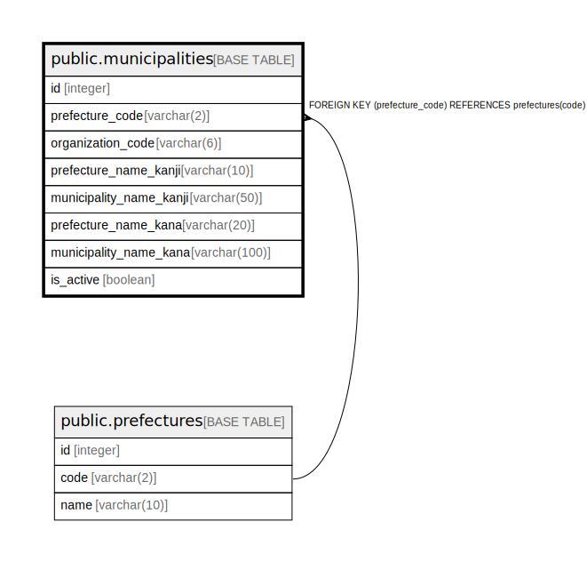

# public.municipalities

## Description

市町村マスタテーブル - 全国の都道府県・市区町村の基本情報を管理

## Columns

| Name | Type | Default | Nullable | Children | Parents | Comment |
| ---- | ---- | ------- | -------- | -------- | ------- | ------- |
| id | integer | nextval('municipalities_id_seq'::regclass) | false |  |  | 内部ID（主キー、自動採番） |
| prefecture_code | varchar(2) |  | false |  | [public.prefectures](public.prefectures.md) | 都道府県ID（外部キー、都道府県マスタのID） |
| organization_code | varchar(6) |  | false |  |  | 団体コード（総務省地方公共団体コード、6桁） |
| prefecture_name_kanji | varchar(10) |  | false |  |  | 都道府県名（漢字表記） |
| municipality_name_kanji | varchar(50) |  | false |  |  | 市区町村名（漢字表記） |
| prefecture_name_kana | varchar(20) |  | false |  |  | 都道府県名（カタカナ表記） |
| municipality_name_kana | varchar(100) |  | false |  |  | 市区町村名（カタカナ表記） |
| is_active | boolean | true | false |  |  | 有効フラグ（TRUE: 有効、FALSE: 無効） |

## Constraints

| Name | Type | Definition |
| ---- | ---- | ---------- |
| municipalities_prefecture_code_fkey | FOREIGN KEY | FOREIGN KEY (prefecture_code) REFERENCES prefectures(code) |
| municipalities_pkey | PRIMARY KEY | PRIMARY KEY (id) |
| municipalities_organization_code_key | UNIQUE | UNIQUE (organization_code) |

## Indexes

| Name | Definition |
| ---- | ---------- |
| municipalities_pkey | CREATE UNIQUE INDEX municipalities_pkey ON public.municipalities USING btree (id) |
| municipalities_organization_code_key | CREATE UNIQUE INDEX municipalities_organization_code_key ON public.municipalities USING btree (organization_code) |
| idx_municipalities_prefecture_id | CREATE INDEX idx_municipalities_prefecture_id ON public.municipalities USING btree (prefecture_code) |
| idx_municipalities_organization_code | CREATE INDEX idx_municipalities_organization_code ON public.municipalities USING btree (organization_code) |
| idx_municipalities_prefecture_kanji | CREATE INDEX idx_municipalities_prefecture_kanji ON public.municipalities USING btree (prefecture_name_kanji) |
| idx_municipalities_municipality_kanji | CREATE INDEX idx_municipalities_municipality_kanji ON public.municipalities USING btree (municipality_name_kanji) |
| idx_municipalities_pref_muni_kanji | CREATE INDEX idx_municipalities_pref_muni_kanji ON public.municipalities USING btree (prefecture_name_kanji, municipality_name_kanji) |
| idx_municipalities_prefecture_kana | CREATE INDEX idx_municipalities_prefecture_kana ON public.municipalities USING btree (prefecture_name_kana) |
| idx_municipalities_municipality_kana | CREATE INDEX idx_municipalities_municipality_kana ON public.municipalities USING btree (municipality_name_kana) |
| idx_municipalities_is_active | CREATE INDEX idx_municipalities_is_active ON public.municipalities USING btree (is_active) |

## Relations

---

> Generated by [tbls](https://github.com/k1LoW/tbls)
