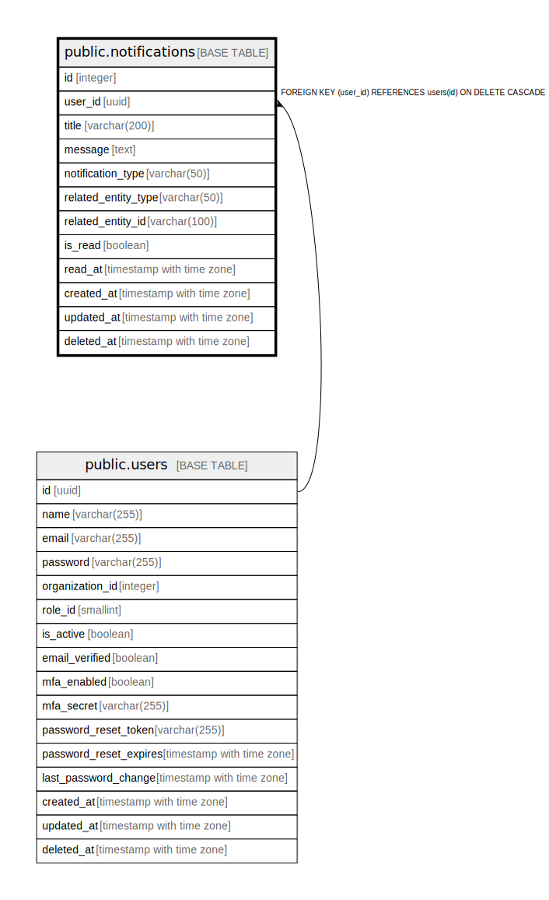

# public.notifications

## Description

通知テーブル - ユーザーへの通知を管理

## Columns

| Name | Type | Default | Nullable | Children | Parents | Comment |
| ---- | ---- | ------- | -------- | -------- | ------- | ------- |
| id | integer | nextval('notifications_id_seq'::regclass) | false |  |  | 通知ID - 主キー |
| user_id | uuid |  | false |  | [public.users](public.users.md) | ユーザーID - 通知の宛先ユーザーID |
| title | varchar(200) |  | false |  |  | タイトル - 通知のタイトル |
| message | text |  | false |  |  | メッセージ - 通知の本文 |
| notification_type | varchar(50) |  | false |  |  | 通知種別 - 通知の種類 |
| related_entity_type | varchar(50) |  | true |  |  | 関連エンティティ種別 - 通知に関連するエンティティの種類 |
| related_entity_id | varchar(100) |  | true |  |  | 関連エンティティID - 通知に関連するエンティティのID |
| is_read | boolean | false | false |  |  | 既読フラグ - 通知が既読かどうか |
| read_at | timestamp with time zone |  | true |  |  | 既読日時 - 通知が既読になった日時 |
| created_at | timestamp with time zone | CURRENT_TIMESTAMP | false |  |  | 作成日時 - レコード作成日時 |
| updated_at | timestamp with time zone | CURRENT_TIMESTAMP | false |  |  | 更新日時 - レコード最終更新日時 |
| deleted_at | timestamp with time zone |  | true |  |  | 削除日時 - 論理削除用のタイムスタンプ |

## Constraints

| Name | Type | Definition |
| ---- | ---- | ---------- |
| notifications_notification_type_check | CHECK | CHECK (((notification_type)::text = ANY ((ARRAY['システム'::character varying, '災害情報'::character varying, '査定'::character varying, '申請'::character varying, 'リマインダー'::character varying, 'その他'::character varying])::text[]))) |
| notifications_user_id_fkey | FOREIGN KEY | FOREIGN KEY (user_id) REFERENCES users(id) ON DELETE CASCADE |
| notifications_pkey | PRIMARY KEY | PRIMARY KEY (id) |

## Indexes

| Name | Definition |
| ---- | ---------- |
| notifications_pkey | CREATE UNIQUE INDEX notifications_pkey ON public.notifications USING btree (id) |
| idx_notifications_user_id | CREATE INDEX idx_notifications_user_id ON public.notifications USING btree (user_id) |
| idx_notifications_is_read | CREATE INDEX idx_notifications_is_read ON public.notifications USING btree (is_read) |
| idx_notifications_notification_type | CREATE INDEX idx_notifications_notification_type ON public.notifications USING btree (notification_type) |
| idx_notifications_created_at | CREATE INDEX idx_notifications_created_at ON public.notifications USING btree (created_at) |

## Triggers

| Name | Definition |
| ---- | ---------- |
| update_notifications_updated_at | CREATE TRIGGER update_notifications_updated_at BEFORE UPDATE ON public.notifications FOR EACH ROW EXECUTE FUNCTION update_master_updated_at_column() |

## Relations

---

> Generated by [tbls](https://github.com/k1LoW/tbls)
