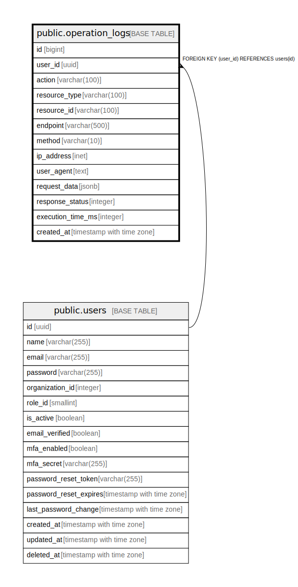

# public.operation_logs

## Description

監査ログテーブル - システムの操作履歴を管理

## Columns

| Name | Type | Default | Nullable | Children | Parents | Comment |
| ---- | ---- | ------- | -------- | -------- | ------- | ------- |
| id | bigint |  | false |  |  | 監査ログID（主キー、自動掲番） |
| user_id | uuid |  | true |  | [public.users](public.users.md) | ユーザーID（外部キー、ユーザーテーブルのID） |
| action | varchar(100) |  | false |  |  | 実行されたアクション（例: create, update, delete） |
| resource_type | varchar(100) |  | true |  |  | リソースの種類（例: user, organization, role） |
| resource_id | varchar(100) |  | true |  |  | リソースID（アクションが適用されたリソースのID） |
| endpoint | varchar(500) |  | true |  |  | APIエンドポイント（例: /api/users, /api/organizations） |
| method | varchar(10) |  | true |  |  | HTTPメソッド（例: GET, POST, PUT, DELETE） |
| ip_address | inet |  | true |  |  | ユーザーのIPアドレス |
| user_agent | text |  | true |  |  | ユーザーエージェント情報（ブラウザやデバイス情報） |
| request_data | jsonb |  | true |  |  | リクエストデータ（JSON形式） |
| response_status | integer |  | true |  |  | レスポンスステータスコード（例: 200, 404, 500） |
| execution_time_ms | integer |  | true |  |  | リクエストの実行時間（ミリ秒単位） |
| created_at | timestamp with time zone | CURRENT_TIMESTAMP | true |  |  | 監査ログの作成日時 |

## Constraints

| Name | Type | Definition |
| ---- | ---- | ---------- |
| operation_logs_user_id_fkey | FOREIGN KEY | FOREIGN KEY (user_id) REFERENCES users(id) |
| operation_logs_pkey | PRIMARY KEY | PRIMARY KEY (id) |

## Indexes

| Name | Definition |
| ---- | ---------- |
| operation_logs_pkey | CREATE UNIQUE INDEX operation_logs_pkey ON public.operation_logs USING btree (id) |
| idx_operation_logs_user_id | CREATE INDEX idx_operation_logs_user_id ON public.operation_logs USING btree (user_id) |
| idx_operation_logs_action | CREATE INDEX idx_operation_logs_action ON public.operation_logs USING btree (action) |
| idx_operation_logs_resource_type | CREATE INDEX idx_operation_logs_resource_type ON public.operation_logs USING btree (resource_type) |
| idx_operation_logs_resource_id | CREATE INDEX idx_operation_logs_resource_id ON public.operation_logs USING btree (resource_id) |
| idx_operation_logs_endpoint | CREATE INDEX idx_operation_logs_endpoint ON public.operation_logs USING btree (endpoint) |
| idx_operation_logs_method | CREATE INDEX idx_operation_logs_method ON public.operation_logs USING btree (method) |
| idx_operation_logs_request_data | CREATE INDEX idx_operation_logs_request_data ON public.operation_logs USING btree (request_data) |
| idx_operation_logs_response_status | CREATE INDEX idx_operation_logs_response_status ON public.operation_logs USING btree (response_status) |
| idx_operation_logs_execution_time_ms | CREATE INDEX idx_operation_logs_execution_time_ms ON public.operation_logs USING btree (execution_time_ms) |
| idx_operation_logs_created_at | CREATE INDEX idx_operation_logs_created_at ON public.operation_logs USING btree (created_at) |

## Relations

---

> Generated by [tbls](https://github.com/k1LoW/tbls)
