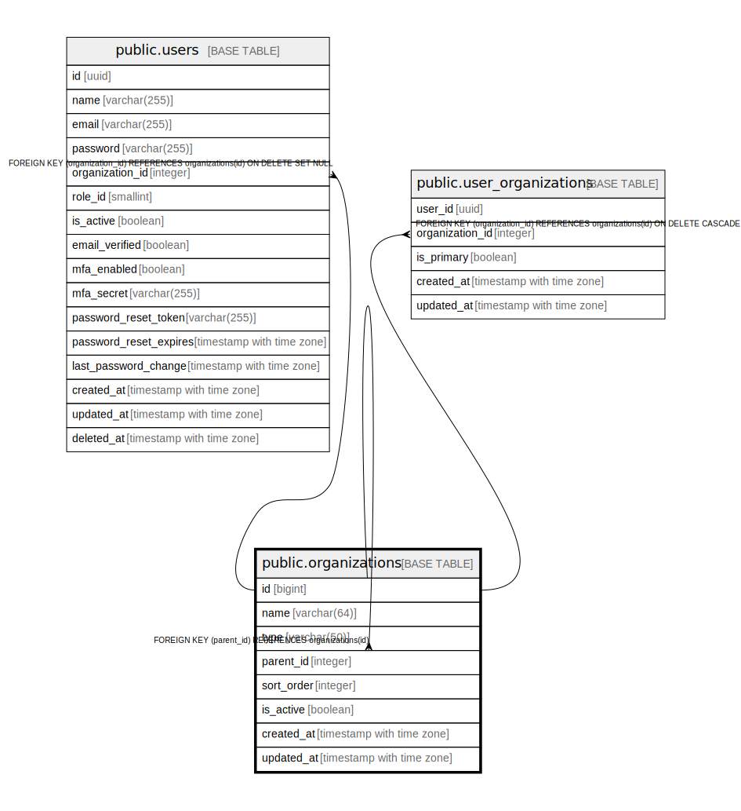

# public.organizations

## Description

組織マスタ - 農林水産省、地方農政局、都道府県などの組織情報を管理

## Columns

| Name | Type | Default | Nullable | Children | Parents | Comment |
| ---- | ---- | ------- | -------- | -------- | ------- | ------- |
| id | bigint |  | false | [public.organizations](public.organizations.md) [public.users](public.users.md) [public.user_organizations](public.user_organizations.md) |  | 組織ID（主キー、自動掲番） |
| name | varchar(64) |  | false |  |  | 組織名 |
| type | varchar(50) |  | false |  |  | 組織の種類（MAFF: 農林水産本省、regional: 地方農政局、prefecture: 都道府県） |
| parent_id | integer |  | true |  | [public.organizations](public.organizations.md) | 親組織ID（階層構造を持つための外部キー） |
| sort_order | integer | 0 | true |  |  | 表示順序 |
| is_active | boolean | true | true |  |  | 有効フラグ（TRUE: 有効、FALSE: 無効） |
| created_at | timestamp with time zone | CURRENT_TIMESTAMP | false |  |  |  |
| updated_at | timestamp with time zone | CURRENT_TIMESTAMP | false |  |  |  |

## Constraints

| Name | Type | Definition |
| ---- | ---- | ---------- |
| organizations_type_check | CHECK | CHECK (((type)::text = ANY ((ARRAY['MAFF'::character varying, 'regional'::character varying, 'prefecture'::character varying])::text[]))) |
| organizations_parent_id_fkey | FOREIGN KEY | FOREIGN KEY (parent_id) REFERENCES organizations(id) |
| organizations_pkey | PRIMARY KEY | PRIMARY KEY (id) |

## Indexes

| Name | Definition |
| ---- | ---------- |
| organizations_pkey | CREATE UNIQUE INDEX organizations_pkey ON public.organizations USING btree (id) |
| idx_organizations_name | CREATE INDEX idx_organizations_name ON public.organizations USING btree (name) |
| idx_organizations_type | CREATE INDEX idx_organizations_type ON public.organizations USING btree (type) |
| idx_organizations_parent_id | CREATE INDEX idx_organizations_parent_id ON public.organizations USING btree (parent_id) |
| idx_organizations_sort_order | CREATE INDEX idx_organizations_sort_order ON public.organizations USING btree (sort_order) |
| idx_organizations_is_active | CREATE INDEX idx_organizations_is_active ON public.organizations USING btree (is_active) |

## Triggers

| Name | Definition |
| ---- | ---------- |
| update_organizations_updated_at | CREATE TRIGGER update_organizations_updated_at BEFORE UPDATE ON public.organizations FOR EACH ROW EXECUTE FUNCTION update_master_updated_at_column() |

## Relations

---

> Generated by [tbls](https://github.com/k1LoW/tbls)
