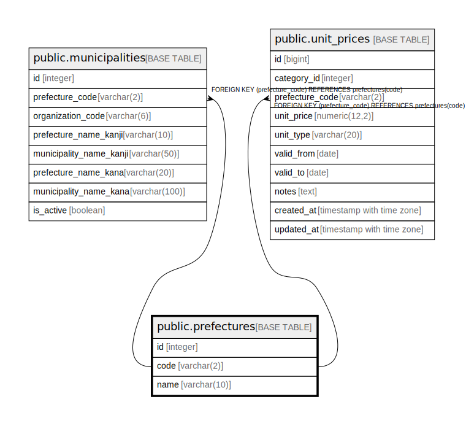

# public.prefectures

## Description

## Columns

| Name | Type | Default | Nullable | Children | Parents | Comment |
| ---- | ---- | ------- | -------- | -------- | ------- | ------- |
| id | integer | nextval('prefectures_id_seq'::regclass) | false |  |  | 都道府県名 |
| code | varchar(2) |  | false | [public.municipalities](public.municipalities.md) [public.unit_prices](public.unit_prices.md) |  |  |
| name | varchar(10) |  | false |  |  | 都道府県名 |

## Constraints

| Name | Type | Definition |
| ---- | ---- | ---------- |
| prefectures_pkey | PRIMARY KEY | PRIMARY KEY (id) |
| prefectures_code_key | UNIQUE | UNIQUE (code) |
| prefectures_name_key | UNIQUE | UNIQUE (name) |

## Indexes

| Name | Definition |
| ---- | ---------- |
| prefectures_pkey | CREATE UNIQUE INDEX prefectures_pkey ON public.prefectures USING btree (id) |
| prefectures_code_key | CREATE UNIQUE INDEX prefectures_code_key ON public.prefectures USING btree (code) |
| prefectures_name_key | CREATE UNIQUE INDEX prefectures_name_key ON public.prefectures USING btree (name) |
| idx_prefectures_name | CREATE INDEX idx_prefectures_name ON public.prefectures USING btree (name) |
| idx_prefectures_code | CREATE INDEX idx_prefectures_code ON public.prefectures USING btree (code) |

## Relations

---

> Generated by [tbls](https://github.com/k1LoW/tbls)
