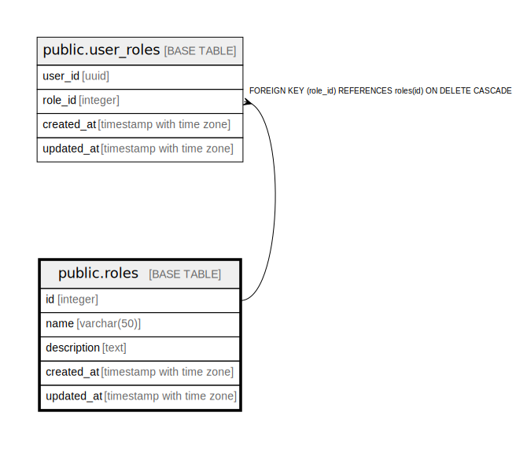

# public.roles

## Description

役割マスタテーブル - ユーザーの役割を管理

## Columns

| Name | Type | Default | Nullable | Children | Parents | Comment |
| ---- | ---- | ------- | -------- | -------- | ------- | ------- |
| id | integer | nextval('roles_id_seq'::regclass) | false | [public.user_roles](public.user_roles.md) |  | 役割ID - 主キー |
| name | varchar(50) |  | false |  |  | 役割名 - 管理者, 一般ユーザー, 査定員など |
| description | text |  | true |  |  | 説明 - 役割の詳細説明と権限 |
| created_at | timestamp with time zone | CURRENT_TIMESTAMP | false |  |  | 作成日時 - レコード作成日時 |
| updated_at | timestamp with time zone | CURRENT_TIMESTAMP | false |  |  | 更新日時 - レコード最終更新日時 |

## Constraints

| Name | Type | Definition |
| ---- | ---- | ---------- |
| roles_pkey | PRIMARY KEY | PRIMARY KEY (id) |
| roles_name_key | UNIQUE | UNIQUE (name) |

## Indexes

| Name | Definition |
| ---- | ---------- |
| roles_pkey | CREATE UNIQUE INDEX roles_pkey ON public.roles USING btree (id) |
| roles_name_key | CREATE UNIQUE INDEX roles_name_key ON public.roles USING btree (name) |
| idx_roles_name | CREATE INDEX idx_roles_name ON public.roles USING btree (name) |

## Triggers

| Name | Definition |
| ---- | ---------- |
| update_roles_updated_at | CREATE TRIGGER update_roles_updated_at BEFORE UPDATE ON public.roles FOR EACH ROW EXECUTE FUNCTION update_master_updated_at_column() |

## Relations

---

> Generated by [tbls](https://github.com/k1LoW/tbls)
