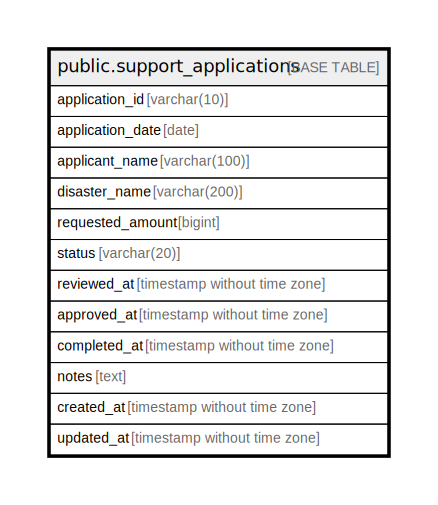

# public.support_applications

## Description

支援申請管理テーブル - 災害時の農業被害に対する支援申請を格納

## Columns

| Name | Type | Default | Nullable | Children | Parents | Comment |
| ---- | ---- | ------- | -------- | -------- | ------- | ------- |
| application_id | varchar(10) |  | false |  |  | 申請ID - 主キー（例：A001, A002...） |
| application_date | date |  | false |  |  | 申請日 - 申請が提出された日付 |
| applicant_name | varchar(100) |  | false |  |  | 申請者名 - 個人名または法人名 |
| disaster_name | varchar(200) |  | false |  |  | 災害名 - 対象となる災害の名称 |
| requested_amount | bigint |  | false |  |  | 申請金額 - 申請する支援金額（円） |
| status | varchar(20) | '審査中'::character varying | false |  |  | ステータス - 申請の処理状況（審査中、書類確認中、承認済、完了、支払処理中、却下） |
| reviewed_at | timestamp without time zone |  | true |  |  | 審査完了日時 - 申請の審査が完了した日時 |
| approved_at | timestamp without time zone |  | true |  |  | 承認日時 - 申請が承認された日時 |
| completed_at | timestamp without time zone |  | true |  |  | 処理完了日時 - 支援金の支払いなど全ての処理が完了した日時 |
| notes | text |  | true |  |  | 備考 - 申請に関する備考やメモ |
| created_at | timestamp without time zone | CURRENT_TIMESTAMP | false |  |  | 作成日時 - レコード作成日時 |
| updated_at | timestamp without time zone | CURRENT_TIMESTAMP | false |  |  | 更新日時 - レコード最終更新日時 |

## Constraints

| Name | Type | Definition |
| ---- | ---- | ---------- |
| support_applications_requested_amount_check | CHECK | CHECK ((requested_amount >= 0)) |
| support_applications_status_check | CHECK | CHECK (((status)::text = ANY ((ARRAY['審査中'::character varying, '書類確認中'::character varying, '承認済'::character varying, '完了'::character varying, '支払処理中'::character varying, '却下'::character varying])::text[]))) |
| support_applications_pkey | PRIMARY KEY | PRIMARY KEY (application_id) |

## Indexes

| Name | Definition |
| ---- | ---------- |
| support_applications_pkey | CREATE UNIQUE INDEX support_applications_pkey ON public.support_applications USING btree (application_id) |
| idx_support_applications_status | CREATE INDEX idx_support_applications_status ON public.support_applications USING btree (status) |
| idx_support_applications_application_date | CREATE INDEX idx_support_applications_application_date ON public.support_applications USING btree (application_date) |
| idx_support_applications_disaster_name | CREATE INDEX idx_support_applications_disaster_name ON public.support_applications USING btree (disaster_name) |

## Triggers

| Name | Definition |
| ---- | ---------- |
| update_support_applications_updated_at | CREATE TRIGGER update_support_applications_updated_at BEFORE UPDATE ON public.support_applications FOR EACH ROW EXECUTE FUNCTION update_updated_at_column() |

## Relations

---

> Generated by [tbls](https://github.com/k1LoW/tbls)
