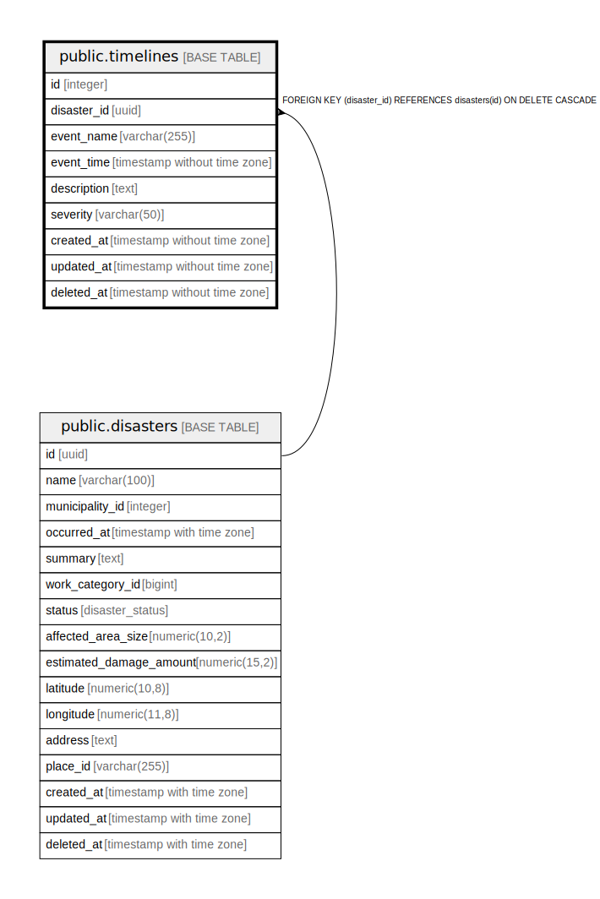

# public.timelines

## Description

災害タイムライン管理テーブル - 各災害のイベント履歴を格納

## Columns

| Name | Type | Default | Nullable | Children | Parents | Comment |
| ---- | ---- | ------- | -------- | -------- | ------- | ------- |
| id | integer | nextval('timelines_id_seq'::regclass) | false |  |  | タイムラインID - 主キー |
| disaster_id | uuid |  | false |  | [public.disasters](public.disasters.md) | 災害ID - 関連する災害のID |
| event_name | varchar(255) |  | false |  |  | イベント名 - 発生したイベントの名称 |
| event_time | timestamp without time zone |  | false |  |  | イベント発生日時 - イベントが発生した日時 |
| description | text |  | false |  |  | イベント説明 - イベントの詳細な説明 |
| severity | varchar(50) |  | true |  |  | イベントの深刻度 - 低, 中, 高などの深刻度 |
| created_at | timestamp without time zone | CURRENT_TIMESTAMP | false |  |  | 作成日時 - レコード作成日時 |
| updated_at | timestamp without time zone | CURRENT_TIMESTAMP | false |  |  | 更新日時 - レコード最終更新日時 |
| deleted_at | timestamp without time zone |  | true |  |  | 削除日時 - 論理削除用のタイムスタンプ |

## Constraints

| Name | Type | Definition |
| ---- | ---- | ---------- |
| timelines_disaster_id_fkey | FOREIGN KEY | FOREIGN KEY (disaster_id) REFERENCES disasters(id) ON DELETE CASCADE |
| timelines_pkey | PRIMARY KEY | PRIMARY KEY (id) |

## Indexes

| Name | Definition |
| ---- | ---------- |
| timelines_pkey | CREATE UNIQUE INDEX timelines_pkey ON public.timelines USING btree (id) |
| idx_timelines_disaster_id | CREATE INDEX idx_timelines_disaster_id ON public.timelines USING btree (disaster_id) |
| idx_timelines_event_time | CREATE INDEX idx_timelines_event_time ON public.timelines USING btree (event_time) |

## Relations

---

> Generated by [tbls](https://github.com/k1LoW/tbls)
