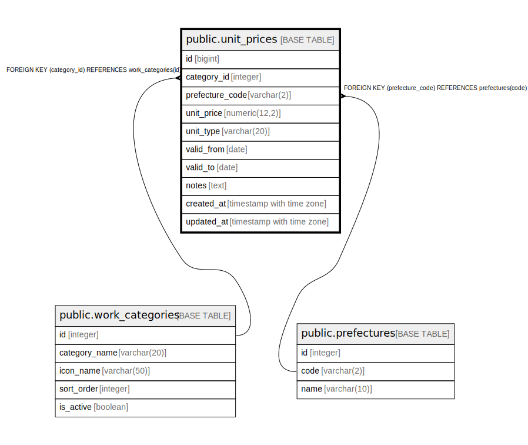

# public.unit_prices

## Description

単価マスタ - 工種区分ごとの単価を管理

## Columns

| Name | Type | Default | Nullable | Children | Parents | Comment |
| ---- | ---- | ------- | -------- | -------- | ------- | ------- |
| id | bigint |  | false |  |  | 単価ID（主キー、自動掲番） |
| category_id | integer |  | false |  | [public.work_categories](public.work_categories.md) | 工種区分ID（外部キー、work_categoriesテーブルのID） |
| prefecture_code | varchar(2) |  | false |  | [public.prefectures](public.prefectures.md) | 都道府県コード（外部キー、prefecturesテーブルのコード） |
| unit_price | numeric(12,2) |  | false |  |  | 単価（円） |
| unit_type | varchar(20) |  | false |  |  | 単位タイプ（"per_meter", "per_sqm", "per_unit"） |
| valid_from | date | CURRENT_DATE | false |  |  | 有効開始日 |
| valid_to | date |  | true |  |  | 有効終了日 |
| notes | text |  | true |  |  | 備考 |
| created_at | timestamp with time zone | now() | false |  |  | 作成日時 |
| updated_at | timestamp with time zone | now() | false |  |  | 更新日時 |

## Constraints

| Name | Type | Definition |
| ---- | ---- | ---------- |
| unit_prices_prefecture_code_fkey | FOREIGN KEY | FOREIGN KEY (prefecture_code) REFERENCES prefectures(code) |
| unit_prices_category_id_fkey | FOREIGN KEY | FOREIGN KEY (category_id) REFERENCES work_categories(id) |
| unit_prices_pkey | PRIMARY KEY | PRIMARY KEY (id) |

## Indexes

| Name | Definition |
| ---- | ---------- |
| unit_prices_pkey | CREATE UNIQUE INDEX unit_prices_pkey ON public.unit_prices USING btree (id) |
| idx_unit_prices_category_id | CREATE INDEX idx_unit_prices_category_id ON public.unit_prices USING btree (category_id) |
| idx_unit_prices_prefecture_code | CREATE INDEX idx_unit_prices_prefecture_code ON public.unit_prices USING btree (prefecture_code) |
| idx_unit_prices_unit_type | CREATE INDEX idx_unit_prices_unit_type ON public.unit_prices USING btree (unit_type) |
| idx_unit_prices_valid_from | CREATE INDEX idx_unit_prices_valid_from ON public.unit_prices USING btree (valid_from) |
| idx_unit_prices_valid_to | CREATE INDEX idx_unit_prices_valid_to ON public.unit_prices USING btree (valid_to) |

## Relations

---

> Generated by [tbls](https://github.com/k1LoW/tbls)
