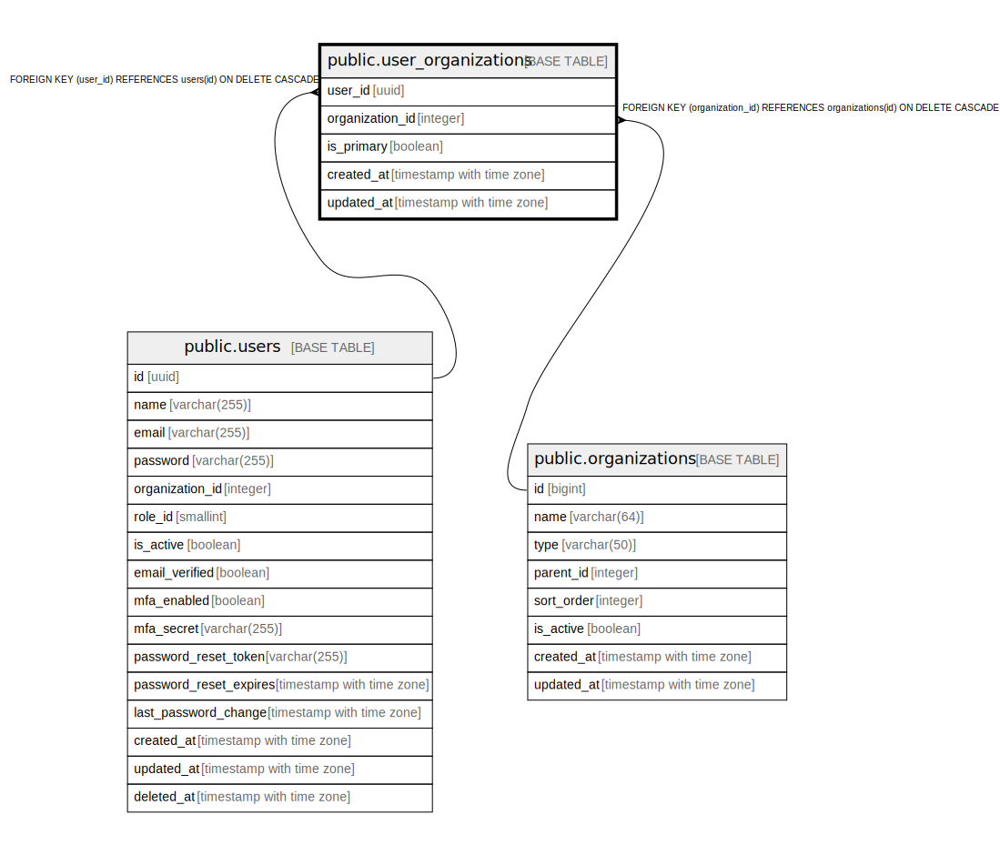

# public.user_organizations

## Description

ユーザー組織関連テーブル - ユーザーと組織の関連を管理

## Columns

| Name | Type | Default | Nullable | Children | Parents | Comment |
| ---- | ---- | ------- | -------- | -------- | ------- | ------- |
| user_id | uuid |  | false |  | [public.users](public.users.md) | ユーザーID - ユーザーテーブルの外部キー |
| organization_id | integer |  | false |  | [public.organizations](public.organizations.md) | 組織ID - 組織テーブルの外部キー |
| is_primary | boolean | false | false |  |  | 主所属フラグ - ユーザーの主所属組織かどうか |
| created_at | timestamp with time zone | CURRENT_TIMESTAMP | false |  |  | 作成日時 - レコード作成日時 |
| updated_at | timestamp with time zone | CURRENT_TIMESTAMP | false |  |  | 更新日時 - レコード最終更新日時 |

## Constraints

| Name | Type | Definition |
| ---- | ---- | ---------- |
| user_organizations_organization_id_fkey | FOREIGN KEY | FOREIGN KEY (organization_id) REFERENCES organizations(id) ON DELETE CASCADE |
| user_organizations_user_id_fkey | FOREIGN KEY | FOREIGN KEY (user_id) REFERENCES users(id) ON DELETE CASCADE |
| user_organizations_pkey | PRIMARY KEY | PRIMARY KEY (user_id, organization_id) |

## Indexes

| Name | Definition |
| ---- | ---------- |
| user_organizations_pkey | CREATE UNIQUE INDEX user_organizations_pkey ON public.user_organizations USING btree (user_id, organization_id) |
| idx_user_organizations_user_id | CREATE INDEX idx_user_organizations_user_id ON public.user_organizations USING btree (user_id) |
| idx_user_organizations_organization_id | CREATE INDEX idx_user_organizations_organization_id ON public.user_organizations USING btree (organization_id) |

## Triggers

| Name | Definition |
| ---- | ---------- |
| update_user_organizations_updated_at | CREATE TRIGGER update_user_organizations_updated_at BEFORE UPDATE ON public.user_organizations FOR EACH ROW EXECUTE FUNCTION update_master_updated_at_column() |

## Relations

---

> Generated by [tbls](https://github.com/k1LoW/tbls)
