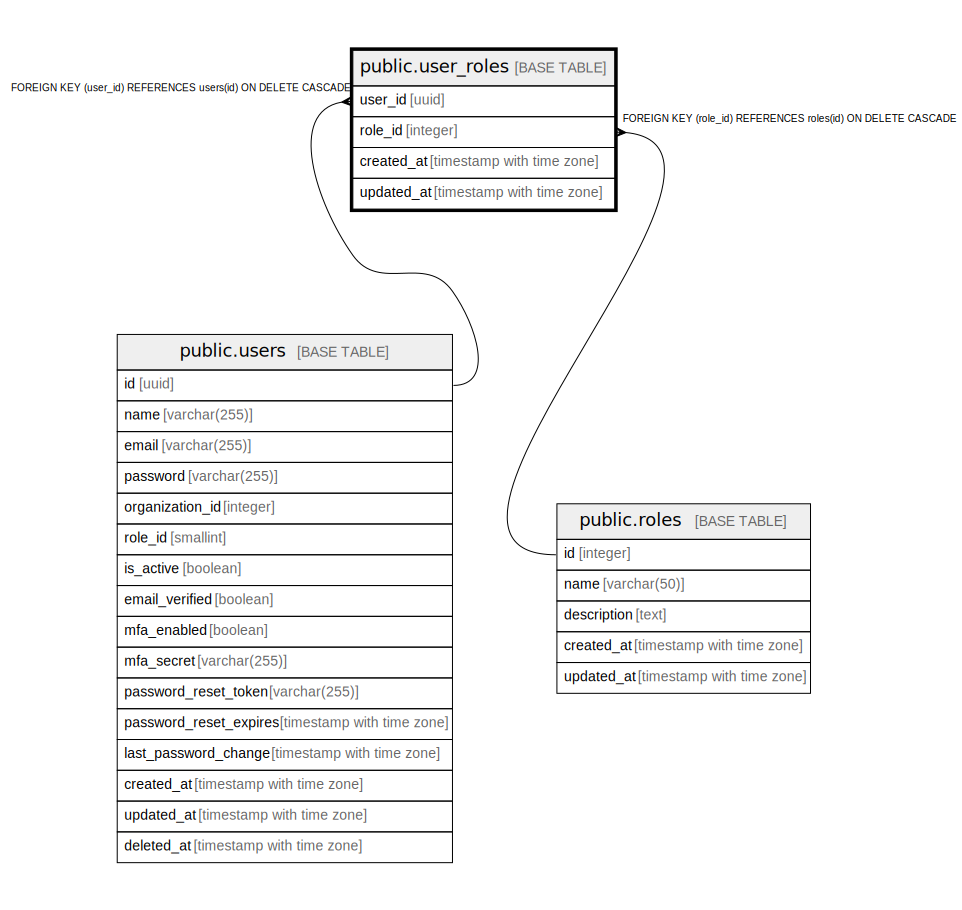

# public.user_roles

## Description

ユーザーロール関連テーブル - ユーザーと役割の関連を管理

## Columns

| Name | Type | Default | Nullable | Children | Parents | Comment |
| ---- | ---- | ------- | -------- | -------- | ------- | ------- |
| user_id | uuid |  | false |  | [public.users](public.users.md) | ユーザーID - ユーザーテーブルの外部キー |
| role_id | integer |  | false |  | [public.roles](public.roles.md) | 役割ID - 役割テーブルの外部キー |
| created_at | timestamp with time zone | CURRENT_TIMESTAMP | false |  |  | 作成日時 - レコード作成日時 |
| updated_at | timestamp with time zone | CURRENT_TIMESTAMP | false |  |  | 更新日時 - レコード最終更新日時 |

## Constraints

| Name | Type | Definition |
| ---- | ---- | ---------- |
| user_roles_user_id_fkey | FOREIGN KEY | FOREIGN KEY (user_id) REFERENCES users(id) ON DELETE CASCADE |
| user_roles_role_id_fkey | FOREIGN KEY | FOREIGN KEY (role_id) REFERENCES roles(id) ON DELETE CASCADE |
| user_roles_pkey | PRIMARY KEY | PRIMARY KEY (user_id, role_id) |

## Indexes

| Name | Definition |
| ---- | ---------- |
| user_roles_pkey | CREATE UNIQUE INDEX user_roles_pkey ON public.user_roles USING btree (user_id, role_id) |
| idx_user_roles_user_id | CREATE INDEX idx_user_roles_user_id ON public.user_roles USING btree (user_id) |
| idx_user_roles_role_id | CREATE INDEX idx_user_roles_role_id ON public.user_roles USING btree (role_id) |

## Triggers

| Name | Definition |
| ---- | ---------- |
| update_user_roles_updated_at | CREATE TRIGGER update_user_roles_updated_at BEFORE UPDATE ON public.user_roles FOR EACH ROW EXECUTE FUNCTION update_master_updated_at_column() |

## Relations

---

> Generated by [tbls](https://github.com/k1LoW/tbls)
