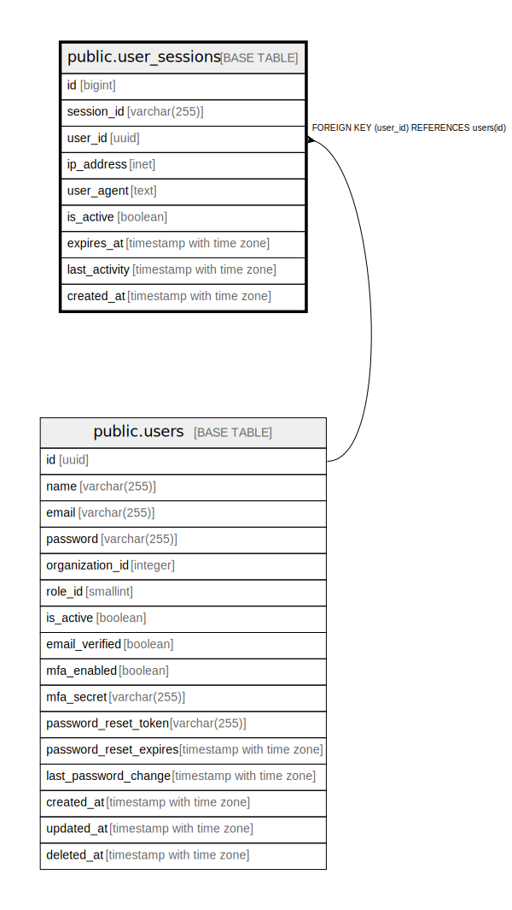

# public.user_sessions

## Description

ユーザーセッションテーブル - ユーザーのログインセッション情報を管理

## Columns

| Name | Type | Default | Nullable | Children | Parents | Comment |
| ---- | ---- | ------- | -------- | -------- | ------- | ------- |
| id | bigint |  | false |  |  | セッションID（主キー、自動掲番） |
| session_id | varchar(255) |  | false |  |  | セッション識別子（ユニーク制約あり） |
| user_id | uuid |  | false |  | [public.users](public.users.md) | ユーザーID（外部キー、ユーザーテーブルのID） |
| ip_address | inet |  | true |  |  | ユーザーのIPアドレス |
| user_agent | text |  | true |  |  | ユーザーエージェント情報（ブラウザやデバイス情報） |
| is_active | boolean | true | true |  |  | セッションの有効フラグ（TRUE: 有効、FALSE: 無効） |
| expires_at | timestamp with time zone |  | false |  |  | セッションの有効期限 |
| last_activity | timestamp with time zone | CURRENT_TIMESTAMP | true |  |  | 最後のアクティビティ日時（セッションの最終アクティビティ） |
| created_at | timestamp with time zone | CURRENT_TIMESTAMP | true |  |  | セッション作成日時 |

## Constraints

| Name | Type | Definition |
| ---- | ---- | ---------- |
| user_sessions_user_id_fkey | FOREIGN KEY | FOREIGN KEY (user_id) REFERENCES users(id) |
| user_sessions_pkey | PRIMARY KEY | PRIMARY KEY (id) |
| user_sessions_session_id_key | UNIQUE | UNIQUE (session_id) |

## Indexes

| Name | Definition |
| ---- | ---------- |
| user_sessions_pkey | CREATE UNIQUE INDEX user_sessions_pkey ON public.user_sessions USING btree (id) |
| user_sessions_session_id_key | CREATE UNIQUE INDEX user_sessions_session_id_key ON public.user_sessions USING btree (session_id) |
| idx_user_sessions_user_id | CREATE INDEX idx_user_sessions_user_id ON public.user_sessions USING btree (user_id) |
| idx_user_sessions_session_id | CREATE INDEX idx_user_sessions_session_id ON public.user_sessions USING btree (session_id) |

## Relations

---

> Generated by [tbls](https://github.com/k1LoW/tbls)
