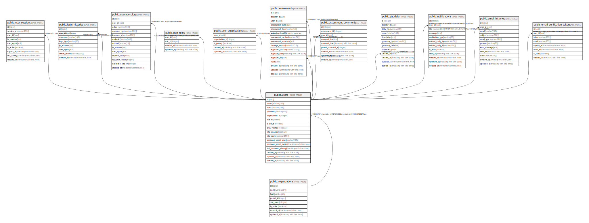

# public.users

## Description

ユーザーテーブル - システムのユーザー情報を管理

## Columns

| Name | Type | Default | Nullable | Children | Parents | Comment |
| ---- | ---- | ------- | -------- | -------- | ------- | ------- |
| id | uuid | gen_random_uuid() | false | [public.user_sessions](public.user_sessions.md) [public.login_histories](public.login_histories.md) [public.operation_logs](public.operation_logs.md) [public.user_roles](public.user_roles.md) [public.user_organizations](public.user_organizations.md) [public.assessments](public.assessments.md) [public.assessment_comments](public.assessment_comments.md) [public.gis_data](public.gis_data.md) [public.notifications](public.notifications.md) [public.email_histories](public.email_histories.md) [public.email_verification_tokens](public.email_verification_tokens.md) |  | ユーザーID（主キー、自動掲番） |
| name | varchar(255) |  | false |  |  | ユーザー名 |
| email | varchar(255) |  | false |  |  | メールアドレス（ユニーク制約あり） |
| password | varchar(255) |  | false |  |  | ハッシュ化されたパスワード |
| organization_id | integer |  | true |  | [public.organizations](public.organizations.md) | 組織ID（外部キー、組織マスタのID） |
| role_id | smallint |  | false |  |  | 役割ID（外部キー、役割マスタのID） |
| is_active | boolean | true | false |  |  | 有効フラグ（TRUE: 有効、FALSE: 無効） |
| email_verified | boolean | false | false |  |  | メールアドレスの確認済みフラグ（TRUE: 確認済み、FALSE: 未確認） |
| mfa_enabled | boolean | false | true |  |  | 多要素認証の有効フラグ（TRUE: 有効、FALSE: 無効） |
| mfa_secret | varchar(255) |  | true |  |  | 多要素認証のシークレットキー（TOTP用） |
| password_reset_token | varchar(255) |  | true |  |  | パスワードリセット用のトークン |
| password_reset_expires | timestamp with time zone |  | true |  |  | パスワードリセットトークンの有効期限 |
| last_password_change | timestamp with time zone | CURRENT_TIMESTAMP | true |  |  | 最後のパスワード変更日時 |
| created_at | timestamp with time zone | CURRENT_TIMESTAMP | true |  |  | ユーザー作成日時 |
| updated_at | timestamp with time zone | CURRENT_TIMESTAMP | true |  |  | ユーザー情報の最終更新日時 |
| deleted_at | timestamp with time zone |  | true |  |  | ユーザー削除日時（論理削除用、NULLの場合は削除されていない） |

## Constraints

| Name | Type | Definition |
| ---- | ---- | ---------- |
| users_organization_id_fkey | FOREIGN KEY | FOREIGN KEY (organization_id) REFERENCES organizations(id) ON DELETE SET NULL |
| users_pkey | PRIMARY KEY | PRIMARY KEY (id) |
| users_email_key | UNIQUE | UNIQUE (email) |

## Indexes

| Name | Definition |
| ---- | ---------- |
| users_pkey | CREATE UNIQUE INDEX users_pkey ON public.users USING btree (id) |
| users_email_key | CREATE UNIQUE INDEX users_email_key ON public.users USING btree (email) |
| idx_users_id_hash | CREATE INDEX idx_users_id_hash ON public.users USING hash (id) |
| idx_users_email | CREATE INDEX idx_users_email ON public.users USING btree (email) |
| idx_users_organization_id | CREATE INDEX idx_users_organization_id ON public.users USING btree (organization_id) |
| idx_users_role_id | CREATE INDEX idx_users_role_id ON public.users USING btree (role_id) |
| idx_users_is_active | CREATE INDEX idx_users_is_active ON public.users USING btree (is_active) |

## Relations

---

> Generated by [tbls](https://github.com/k1LoW/tbls)
