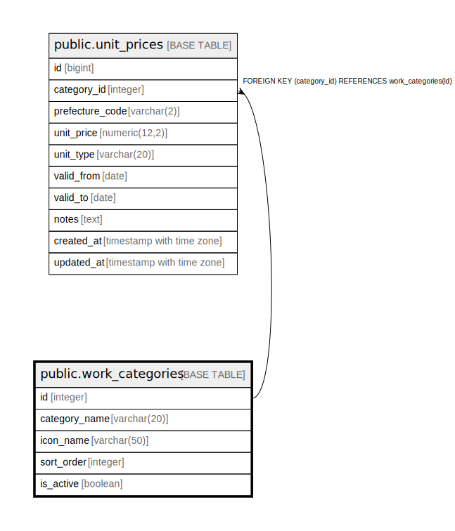

# public.work_categories

## Description

工種区分マスタ - 工種区分の基本情報を管理

## Columns

| Name | Type | Default | Nullable | Children | Parents | Comment |
| ---- | ---- | ------- | -------- | -------- | ------- | ------- |
| id | integer | nextval('work_categories_id_seq'::regclass) | false | [public.unit_prices](public.unit_prices.md) |  | 工種区分ID（主キー、自動掲番） |
| category_name | varchar(20) |  | false |  |  | 工種区分名（漢字表記） |
| icon_name | varchar(50) |  | false |  |  | アイコンファイル名 |
| sort_order | integer | 0 | false |  |  | 表示順序 |
| is_active | boolean | true | false |  |  | 有効フラグ（TRUE: 有効、FALSE: 無効） |

## Constraints

| Name | Type | Definition |
| ---- | ---- | ---------- |
| work_categories_pkey | PRIMARY KEY | PRIMARY KEY (id) |

## Indexes

| Name | Definition |
| ---- | ---------- |
| work_categories_pkey | CREATE UNIQUE INDEX work_categories_pkey ON public.work_categories USING btree (id) |
| idx_work_categories_category_name | CREATE INDEX idx_work_categories_category_name ON public.work_categories USING btree (category_name) |
| idx_work_categories_icon_name | CREATE INDEX idx_work_categories_icon_name ON public.work_categories USING btree (icon_name) |
| idx_work_categories_sort_order | CREATE INDEX idx_work_categories_sort_order ON public.work_categories USING btree (sort_order) |
| idx_work_categories_is_active | CREATE INDEX idx_work_categories_is_active ON public.work_categories USING btree (is_active) |

## Relations

---

> Generated by [tbls](https://github.com/k1LoW/tbls)
